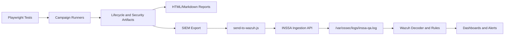

# Web App QA Tests

Reusable Playwright QA and security harness for hosted web apps, with the most mature operational platform currently focused on INSSA staging.

Primary INSSA target:

```text
https://staging.inssa.us
```

Production INSSA live mutation and security lifecycle tests are blocked by design.

## Project Overview

This repo provides:

- Safe regression tests for INSSA compose, media, and route stability.
- Opt-in live lifecycle campaigns for text, media, video, and reveal-later capsules.
- Security campaigns for OWASP-aligned black-box validation.
- Security verification campaigns for tokenless, media, reveal-later, and cross-user access control.
- Persistent lifecycle and security artifacts.
- Human-readable reports.
- Metadata-only SIEM export.
- Wazuh ingestion, decoder/rule documentation, dashboard design, and alert-routing runbooks.

This repo does not contain INSSA application source code, backend access, database access, cloud access, or production test credentials.

## Architecture



The local INSSA QA Operations Dashboard wraps the existing scripts without replacing them:

```text
Authenticated Dashboard
-> Command Registry
-> Runner
-> Whitelisted npm script
-> Logs and artifact indexing
-> Report archive
```

Current dashboard source-of-truth documents:

- [Current Platform State](docs/inssa-platform-current-state.md)
- [Dashboard Architecture](docs/inssa-dashboard-architecture.md)
- [V1 Definition](docs/inssa-v1-definition.md)
- [Command Matrix](docs/inssa-command-matrix.md)
- [Dashboard Decisions](docs/inssa-dashboard-decisions.md)
- [Dashboard Roadmap](docs/inssa-dashboard-roadmap.md)
- [2026 Handoff](docs/inssa-handoff-2026.md)

## Campaign Types

| Campaign | Purpose | Mutates Staging | Command |
| --- | --- | --- | --- |
| Safe INSSA suite | Non-destructive regression checks. | No | `npm run test:inssa:safe` |
| Text lifecycle | Create one text live capsule and validate downstream lifecycle. | Yes | `npm run test:inssa:campaign:text` |
| Media lifecycle | Create one image live capsule and validate downstream lifecycle. | Yes | `npm run test:inssa:campaign:media` |
| Video lifecycle | Create one video live capsule and validate downstream lifecycle. | Yes | `npm run test:inssa:campaign:video` |
| Reveal-later lifecycle | Create one scheduled capsule and validate lifecycle behavior. | Yes | `npm run test:inssa:campaign:reveal-later` |
| Security campaign | OWASP-aligned black-box security audit. | No by default | `npm run test:inssa:campaign:security` |
| Security verification | Verify known security findings from artifacts. | No | `npm run test:inssa:campaign:security:verify` |
| Cross-user campaign | Verify primary/secondary QA user access-control behavior. | Yes | `npm run test:inssa:campaign:cross-user` |
| Reveal-later security | Verify reveal-later access-control behavior. | No unless artifact creation is separately run | `npm run test:inssa:campaign:reveal-later-security` |

Dashboard exposure is intentionally narrower than CLI capability. The dashboard currently exposes only V1 safe/read-only actions, artifact validation, report rendering, SIEM export, and healthcheck. Live lifecycle, cross-user, reveal-later security, and SIEM send actions remain visible-but-disabled or hidden until approval/cleanup/transmission workflows exist.

## Security Coverage

| Area | Coverage |
| --- | --- |
| Access control | Tokenized, tokenless, authenticated, logged-out, direct route, and cross-user behavior. |
| Media access | Image/video retrieval and public accessibility classification. |
| Reveal-later | Pre-reveal access protection and timestamp evidence. |
| Cross-user | Targeted sharing and secondary account retrieval behavior. |
| Authentication | Route guarding and session behavior. |
| Security headers | HTTPS, HSTS, CSP, frame, referrer, permissions, content-type checks. |
| Input probes | Safe payload checks when explicitly enabled. |

## Lifecycle Coverage

| Area | Status |
| --- | --- |
| Draft write/cleanup | Validated and mutation-gated. |
| Text live capsule | Validated. |
| Media live capsule | Validated with warning classifications. |
| Video live capsule | Validated with static fixture support. |
| Contact-share delivery | Validated. |
| Public share retrieval | Validated. |
| Authenticated discovery | Classified as direct-share/contact delivery rather than broad indexing by default. |
| Reveal-later pre-reveal | Validated. |
| Reveal-later post-reveal | Follow-up remains open. |

## SIEM Integration

SIEM flow:

```text
Campaign artifacts
-> npm run siem:export
-> npm run siem:send
-> https://wazuh.kbeanprobo.com/inssa
-> /var/ossec/logs/inssa-qa.log
-> Wazuh Decoder
-> Wazuh Rules
-> Dashboards and alerts
```

SIEM payloads are metadata-only. Screenshots, videos, traces, and unredacted tokens are refused by the sender.

## Reporting

| Report Area | Location |
| --- | --- |
| Security reports | `reports/security/` |
| Lifecycle reports | `reports/lifecycle/` |
| SIEM export | `reports/siem/latest-siem-export.json` |
| Final program report | `docs/inssa-final-program-report.md` |
| Risk matrix | `docs/inssa-risk-matrix.md` |
| Engineering review | `docs/inssa-engineering-review.md` |

## Wazuh Integration

| Component | Path |
| --- | --- |
| Ingestion service | `services/inssa-ingestion/server.js` |
| Systemd unit | `services/inssa-ingestion/inssa-ingestion.service` |
| Nginx config | `services/inssa-ingestion/nginx-inssa-ingestion.conf` |
| Decoder guide | `docs/wazuh-inssa-decoder.md` |
| Rules guide | `docs/wazuh-inssa-rules.md` |
| Ingestion guide | `docs/wazuh-inssa-ingestion.md` |
| Dashboard design | `docs/inssa-dashboard-engineering.md` |
| Alert routing | `docs/inssa-alert-routing.md` |

## Directory Structure

```text
tests/inssa/                         Playwright specs
pages/inssa/                         INSSA page objects
utils/                               Shared test utilities
scripts/inssa/                       Campaign runners and reports
scripts/siem/                        SIEM normalization and senders
services/inssa-ingestion/            Wazuh ingestion service
docs/                                Operations, security, SIEM, dashboard, runbook docs
lifecycle-artifacts/                 Persistent live lifecycle evidence, ignored
lifecycle-campaigns/                 Campaign summaries, ignored
security-campaigns/                  Security outputs, ignored
reports/                             Generated human/SIEM reports, ignored or environment-local
```

## Quick Start

Install:

```bash
npm install
npm run install:browsers
```

Run safe INSSA baseline:

```bash
npm run test:inssa:safe
```

Run security campaign:

```bash
npm run test:inssa:campaign:security
```

Export SIEM metadata:

```bash
npm run siem:export
```

Send SIEM metadata:

```bash
SIEM_WAZUH_URL=https://wazuh.kbeanprobo.com/inssa SIEM_SEND_BATCH=1 npm run siem:send
```

Run platform healthcheck:

```bash
npm run platform:healthcheck
```

Run the local Operations Dashboard:

```bash
npm run dashboard:dev
```

The dashboard requires Supabase Auth configuration and `INSSA_URL=https://staging.inssa.us` before command execution.

## Environment Setup

Copy non-secret examples:

```bash
cp .env.example .env
cp .env.inssa.live-staging.example .env.inssa.live-staging
```

Never commit real credentials.

Important INSSA variables:

| Variable | Purpose |
| --- | --- |
| `INSSA_URL=https://staging.inssa.us` | Required staging target. |
| `INSSA_TEST_EMAIL` | Primary QA account. |
| `INSSA_TEST_PASSWORD` | Primary QA password. |
| `INSSA_SECONDARY_TEST_EMAIL` | Secondary QA account for cross-user validation. |
| `INSSA_SECONDARY_TEST_PASSWORD` | Secondary QA password. |
| `INSSA_ENABLE_LIVE_CAPSULE_TESTS=1` | Enables live staging capsule creation tests. |
| `INSSA_LIVE_CAPSULE_MANUAL_CLEANUP_APPROVED=1` | Acknowledges manual cleanup responsibility. |
| `INSSA_ENABLE_MEDIA_CAPSULE_TESTS=1` | Enables media capsule creation. |
| `INSSA_ENABLE_VIDEO_CAPSULE_TESTS=1` | Enables video capsule creation. |
| `INSSA_ENABLE_REVEAL_LATER_CAPSULE_TESTS=1` | Enables reveal-later creation. |
| `INSSA_ENABLE_MUTATION_TESTS=1` | Enables draft mutation tests. |
| `SIEM_WAZUH_URL=https://wazuh.kbeanprobo.com/inssa` | Wazuh ingestion endpoint. |

## Command Matrix

| Category | Command |
| --- | --- |
| Safe tests | `npm run test:inssa:safe` |
| Security campaign | `npm run test:inssa:campaign:security` |
| Security verification | `npm run test:inssa:campaign:security:verify` |
| Cross-user campaign | `npm run test:inssa:campaign:cross-user` |
| Reveal-later security | `npm run test:inssa:campaign:reveal-later-security` |
| SIEM export | `npm run siem:export` |
| SIEM send | `SIEM_WAZUH_URL=https://wazuh.kbeanprobo.com/inssa SIEM_SEND_BATCH=1 npm run siem:send` |
| Security campaign with SIEM | `npm run test:inssa:campaign:security:siem` |
| Cross-user campaign with SIEM | `npm run test:inssa:campaign:cross-user:siem` |
| Reveal-later security with SIEM | `npm run test:inssa:campaign:reveal-later:siem` |
| Healthcheck | `npm run platform:healthcheck` |
| Playwright report | `npm run report:show` |
| Security report | `npm run report:security` |
| Lifecycle report | `npm run report:lifecycle` |

## Daily Operations

1. Run `npm run platform:healthcheck`.
2. Run `npm run test:inssa:safe`.
3. Review `reports/security/`, `reports/lifecycle/`, and `reports/siem/`.
4. Send SIEM metadata after campaign runs.
5. Review Wazuh dashboards for critical and high-risk findings.
6. Track cleanup targets from lifecycle artifacts.

## Troubleshooting

| Problem | First Check |
| --- | --- |
| SIEM send fails | Confirm `SIEM_WAZUH_URL` and run `npm run siem:send -- --dry-run`. |
| Wazuh dashboard missing events | Check `docs/inssa-siem-operations.md`. |
| Ingestion endpoint issue | Check `docs/wazuh-inssa-ingestion.md`. |
| Dashboard issue | Check `docs/inssa-dashboard-runbook.md`. |
| Notification issue | Check `docs/inssa-alert-runbook.md`. |
| Live test skipped | Confirm required live flags in `.env.inssa.live-staging`. |
| Artifact-dependent test fails | Confirm artifact path or latest artifact settings. |

## Release Process

1. Run safe tests.
2. Run required campaign or verification set.
3. Generate reports.
4. Export and send SIEM metadata.
5. Validate dashboards and alerts where access is available.
6. Review known findings and cleanup targets.
7. Update release docs when findings or operational status change.

Release references:

- `docs/inssa-siem-release-gate.md`
- `docs/inssa-platform-validation.md`
- `docs/inssa-final-platform-status.md`
- `docs/inssa-final-program-report.md`

## Cleanup Process

Live staging lifecycle tests create QA-tagged staging data. Cleanup is manual unless a specific cleanup capability has been audited as safe.

Cleanup workflow:

1. Find the lifecycle artifact in `lifecycle-artifacts/`.
2. Use the `runId`, subject, message, capsule ID, and cleanup instruction.
3. Development team deletes the exact QA-created staging capsule.
4. Record cleanup completion in the relevant campaign notes.

Do not broadly delete user data from the QA harness.

## Known Findings

Current warnings:

- `public-by-id`
- `media-publicly-accessible`
- Reveal-later post-reveal follow-up remains open.
- Manual staging cleanup remains required.

Primary references:

- `docs/inssa-final-program-report.md`
- `docs/inssa-risk-matrix.md`
- `docs/inssa-security-findings.md`

## Major Documentation

- [Current Platform State](docs/inssa-platform-current-state.md)
- [Dashboard Architecture](docs/inssa-dashboard-architecture.md)
- [Dashboard Roadmap](docs/inssa-dashboard-roadmap.md)
- [Command Matrix](docs/inssa-command-matrix.md)
- [Dashboard Decisions](docs/inssa-dashboard-decisions.md)
- [V1 Definition](docs/inssa-v1-definition.md)
- [2026 Handoff](docs/inssa-handoff-2026.md)
- [INSSA Platform Operations](docs/inssa-platform-operations.md)
- [Final Program Report](docs/inssa-final-program-report.md)
- [QA Operations Guide](docs/inssa-qa-operations-guide.md)
- [Engineering Review](docs/inssa-engineering-review.md)
- [Security Findings](docs/inssa-security-findings.md)
- [Risk Matrix](docs/inssa-risk-matrix.md)
- [Live Staging Lifecycle](docs/inssa-live-staging-lifecycle.md)
- [Security Campaign](docs/inssa-security-campaign.md)
- [SIEM Architecture](docs/inssa-siem-architecture.md)
- [SIEM Operations](docs/inssa-siem-operations.md)
- [Dashboard Engineering](docs/inssa-dashboard-engineering.md)
- [Alert Routing](docs/inssa-alert-routing.md)
- [Wazuh Ingestion](docs/wazuh-inssa-ingestion.md)
