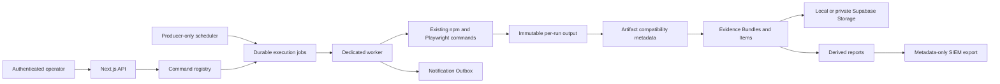

# QA Operations Platform Architecture Summary

Version: `1.0.0`  
Last reviewed: 2026-07-21

## System Flow

## Runtime Boundaries

- Next.js authenticates users, applies RBAC, exposes read APIs, and enqueues approved jobs.
- The worker is the only campaign executor.
- The scheduler evaluates definitions and enqueues jobs; it never executes commands.
- The command registry maps fixed keys to fixed npm scripts. User-provided shell commands are impossible.
- One active execution job is permitted globally.
- Every run writes to `run-output/<runId>/`; historical evidence never resolves through mutable `latest` paths.

## Persistence Boundaries

- Local mode uses versioned JSON snapshots, JSON Lines logs, file locks, and atomic rename.
- Supabase mode uses 11 RLS-protected metadata tables and service-role-only server access.
- Evidence bytes use local run output as scratch/compatibility and private Supabase Storage as the durable copy.
- The browser never receives the service-role key or direct table/storage privileges.

## Evidence Boundaries

- Evidence Bundle is the durable aggregate for one run.
- Evidence Item identifies one file in that bundle.
- Artifact remains a compatibility model for established APIs.
- Playwright reports are served as authenticated bundles so relative assets work.
- Reports are derived views; lifecycle/security JSON remains source evidence.

## Operations Boundaries

- Supabase Auth establishes identity.
- Server-side RBAC controls API access and command execution.
- Notification Outbox stores events but has no provider dispatcher.
- Monitoring definitions are managed metadata; only schedule triggers execute automatically.
- Wazuh receives metadata-only events through an authenticated ingestion service.

## Protected Contracts

Explicit approval is required before changing:

- command registry allowlisting
- durable job, worker lease, or one-active-run behavior
- staging and production-monitoring guards
- auth/RBAC resolution
- artifact compatibility APIs
- Evidence Bundle identity or canonical path checks
- local/Supabase persistence interfaces
- scheduler producer-only behavior
- Notification Outbox no-direct-delivery boundary

See [Architecture Constitution](qa-platform-architecture-constitution.md) for governing detail.
