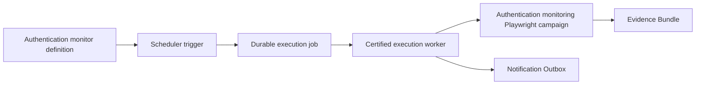

# Authentication Monitoring Campaign

## Purpose

Authentication Monitoring is the first Continuous Platform Monitoring campaign. It uses the existing command registry, durable job queue, execution worker, immutable run output, Evidence Bundle, scheduler, and Notification Outbox without introducing a second execution path.



The scheduler only creates jobs. The worker remains the sole campaign executor, and no notification provider is called.

## Environments

| Environment | Target | Scheduled state | Safety boundary |
| --- | --- | --- | --- |
| INSSA Staging | `https://staging.inssa.us` | Enabled at 12:00 Europe/Dublin | Existing staging credentials; dedicated monitor credentials are preferred |
| INSSA Production | `https://inssa.us` | Midday and evening definitions are provisioned disabled | Requires explicit environment enablement, exact host confirmation, and production-only monitor accounts |

Production execution requires both:

```text
AUTH_MONITOR_ALLOW_PRODUCTION=1
AUTH_MONITOR_PRODUCTION_CONFIRMATION=inssa.us
```

The global Operations Platform `INSSA_URL` guard remains staging-only. Production is reachable only through the separately allowlisted production authentication command, whose wrapper replaces the child Playwright target after validating the production confirmation. Other campaigns cannot use this path.

## Independent Checks

The campaign runs three independent Playwright tests with one worker and no retries:

1. Username and password: sign-in page, credential submission, redirect, authenticated profile, and logout.
2. Google OAuth: provider launch, configured test-account completion, redirect, authenticated profile, and logout.
3. Apple Sign-In: provider launch, configured test-account completion, redirect, authenticated profile, and logout.

Missing credentials, consent pages, MFA, CAPTCHA, security-key prompts, redirect failures, session failures, and logout failures are hard failures for the affected method. The campaign does not bypass provider security challenges or substitute stubs.

All methods execute even when another method fails. The overall status passes only when all three method results pass.

## Configuration

Authentication Monitoring uses one canonical credential namespace:

```text
AUTH_MONITOR_STAGING_EMAIL
AUTH_MONITOR_STAGING_PASSWORD
AUTH_MONITOR_STAGING_GOOGLE_EMAIL
AUTH_MONITOR_STAGING_GOOGLE_PASSWORD
AUTH_MONITOR_STAGING_APPLE_EMAIL
AUTH_MONITOR_STAGING_APPLE_PASSWORD
AUTH_MONITOR_PRODUCTION_EMAIL
AUTH_MONITOR_PRODUCTION_PASSWORD
AUTH_MONITOR_PRODUCTION_GOOGLE_EMAIL
AUTH_MONITOR_PRODUCTION_GOOGLE_PASSWORD
AUTH_MONITOR_PRODUCTION_APPLE_EMAIL
AUTH_MONITOR_PRODUCTION_APPLE_PASSWORD
```

Staging email/password checks fall back to `INSSA_TEST_EMAIL` and `INSSA_TEST_PASSWORD` when dedicated monitor credentials are blank. Google and Apple always require dedicated provider credentials. Production requires dedicated values and never falls back to staging credentials.

The authentication wrapper uses Next's `loadEnvConfig` against `dashboard/`, matching the worker and scheduler. Store monitor credentials in the ignored `dashboard/.env.local` file for dashboard-managed execution. The wrapper does not independently load root `.env` or `.env.inssa.live-staging`.

`AUTH_MONITOR_ENVIRONMENT`, `AUTH_MONITOR_OUTPUT_DIR`, and `AUTH_MONITOR_RUN_ID` are execution-managed internal variables and should not be set for normal operation. The complete variable inventory is in `.env.example`. Secrets remain local and must not be written to logs, summaries, screenshots, or committed files.

## Evidence

Every method writes:

- `result.json` with status and timing
- `console-log.json` with sanitized browser console entries
- `screenshot.png`

Failed methods additionally write `network-log.json`. Playwright uses `trace=retain-on-failure`, so failed tests retain their trace bundle under the run-scoped `test-results` directory. Existing video-on-failure behavior remains unchanged.

The wrapper produces `authentication-monitoring-summary.json` both in the authentication evidence directory and inside the Playwright report bundle. This lets the authenticated dashboard read monitoring results through the certified bundle route without a new file-serving API.

## Commands

```bash
npm run test:inssa:monitor:auth:staging
npm run test:inssa:monitor:auth:production
```

The production command fails before browser startup unless the production gate is satisfied.

## Dashboard

The read-only Authentication Monitoring workspace displays:

- Overall status
- Independent method status and timing
- Execution time
- Last success and failure
- Environment and target host
- Playwright evidence link
- Historical environment-specific runs

It has no scheduler, retry, notification, or credential controls.

## Failure Handling

Any failed method makes Playwright exit non-zero. The existing worker then:

1. Finalizes immutable output.
2. Indexes artifacts and Evidence Bundle metadata.
3. Uploads evidence through the configured durable storage provider.
4. Marks the run failed.
5. Writes the existing deduplicated `run_failed` Notification Outbox event.

Notification delivery remains unimplemented.
