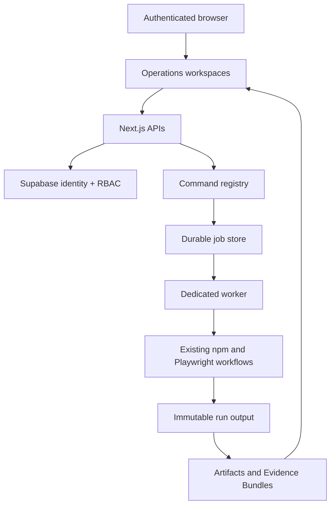

# INSSA Operations Dashboard Architecture

Last reviewed: 2026-07-21

## Role

The Next.js dashboard is a thin authenticated operations layer. It presents campaign definitions, enqueues approved commands, observes durable execution, and reviews evidence. It does not contain Playwright or campaign logic.

## Workspaces

The current sidebar contains Overview, Campaign Library, Testing, Security, Lifecycle, Execution, Artifact Validation, Reports/Evidence Workspace, SIEM, Authentication Monitoring, Monitoring, Notifications, Operations, and Runs.

Execution and evidence remain separate:

- Testing/Security/Artifact Validation enqueue approved work.
- Execution and Runs observe job progress, logs, artifacts, and completion.
- Reports reviews Evidence Bundles and derived reports.
- Monitoring/Notifications are read-only operational views.

## API Surface

Viewer-or-higher read APIs:

- `GET /api/campaign-definitions`
- `GET /api/runs`
- `GET /api/runs/:id`
- `GET /api/runs/:id/logs`
- `GET /api/runs/:id/artifacts`
- `GET /api/runs/:id/evidence`
- `GET /api/artifacts/:id`
- `GET /api/artifacts/:id/file`
- `GET /api/artifacts/:id/bundle/*`
- `GET /api/lifecycle-artifacts`
- `GET /api/notifications` and `GET /api/notifications/:id`
- `GET /api/monitoring-definitions` and `GET /api/monitoring-definitions/:id`
- `GET /api/scheduler/status`

Mutation API:

- `POST /api/runs`, guarded by authentication, role, registry, environment, artifact-selection, one-active-run, and idempotency checks.

Authentication APIs:

- `POST /api/auth/password`
- `POST /api/auth/magic-link`
- `/logout`

## Auth And RBAC

All workspaces redirect anonymous users to `/login`. APIs return `401` for anonymous access and `403` for insufficient role. Client-side visibility is informational only; server guards are authoritative.

| Role | Server capability |
| --- | --- |
| viewer | Read runs, logs, artifacts, evidence, reports, monitoring, notifications, and diagnostics. |
| operator | Viewer plus enabled safe/read-only registry commands except healthcheck; live mutation is denied. |
| admin | Operator plus healthcheck and governed live staging campaigns after approval/preflight. |

## Execution Model

`POST /api/runs` creates a run and execution job, then returns `202`. The worker claims and executes the job independently. The UI polls read APIs and never owns execution.

Governed mutation requests first pass `/api/campaign-approvals` and repeat the same server-side preflight in `POST /api/runs`. The browser cannot provide a target URL. The server requires the exact staging host, an admin role, a healthy supervisor/worker path, no active job, campaign prerequisites, five acknowledgements, and the exact confirmation phrase. Mutation jobs have one attempt so irreversible final actions are not automatically retried.

## Evidence And Report Serving

- Artifact routes resolve from metadata, never a client path.
- Playwright reports use bundle-relative serving for assets.
- Canonical `realpath` checks enforce allowlisted roots and bundle boundaries.
- Textual outputs are redacted.
- Evidence Workspace reads existing metadata; it does not mutate evidence.

## Diagnostics

The UI shows metadata backend and counts, runner state, API failures with endpoint/status/timestamp, scheduler heartbeat, and admin healthcheck access. Empty backend and failed backend states are distinct.

## Styling

Dark and light themes use semantic CSS tokens and persisted `localStorage` preference. Theme switching changes presentation only.

## Protected Boundaries

The UI must not introduce arbitrary commands, bypass server RBAC, execute campaigns in request handlers, replace artifact/evidence APIs, expose direct Storage credentials, or turn notification records into external delivery.
