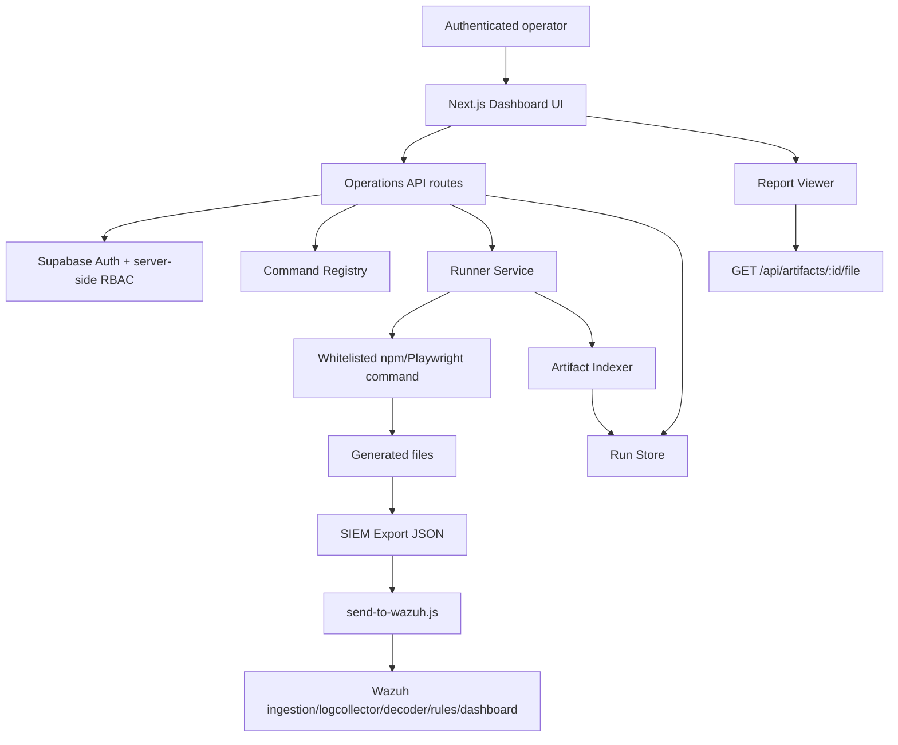

# INSSA Dashboard Architecture

Last updated: 2026-06-11

This document describes the current INSSA QA Operations Dashboard architecture implemented under `dashboard/`.

## Architecture Flow

## Dashboard

Location:

- `dashboard/app/page.tsx`
- `dashboard/components/inssa-ops-client.tsx`

Current sections:

- Overview
- Safe Tests
- Security
- Lifecycle
- Artifact Validation
- Reports
- SIEM
- Operations
- Run History
- Run Details

The UI consumes existing API routes only. It does not execute shell commands directly.

## API Layer

Key routes:

| Route | Purpose | Minimum Role |
| --- | --- | --- |
| `GET /api/campaign-definitions` | List whitelisted commands. | viewer |
| `GET /api/runs` | List runs and metadata backend summary. | viewer |
| `POST /api/runs` | Start a whitelisted run. | viewer plus command authorization |
| `GET /api/runs/:id` | Get one run. | viewer |
| `GET /api/runs/:id/logs` | Get logs for one run. | viewer |
| `GET /api/runs/:id/artifacts` | Get artifact metadata for one run. | viewer |
| `GET /api/lifecycle-artifacts` | List lifecycle artifacts usable for validation. | viewer |
| `GET /api/artifacts/:id/file` | Serve allowlisted report/SIEM files. | viewer |

`POST /api/runs` applies command authorization, environment validation, artifact selection validation where required, and audit logging before starting the runner.

## Auth Model

Supabase Auth is used for dashboard login.

Supported login paths:

- Email/password.
- Magic link.

Required public env variables:

- `NEXT_PUBLIC_SUPABASE_URL`
- `NEXT_PUBLIC_SUPABASE_PUBLISHABLE_KEY`

Server-side fallbacks/keys:

- `SUPABASE_URL`
- `SUPABASE_ANON_KEY`
- `SUPABASE_SERVICE_ROLE_KEY`

## RBAC Model

Roles:

- `viewer`
- `operator`
- `admin`

Role resolution order:

1. Supabase `app_metadata.inssa_ops_role`.
2. `INSSA_OPS_ADMIN_EMAILS`.
3. `INSSA_OPS_OPERATOR_EMAILS`.
4. `INSSA_OPS_VIEWER_EMAILS`.
5. Default `viewer`.

Permissions:

| Role | Permissions |
| --- | --- |
| viewer | View dashboard, runs, logs, artifacts, reports, and lifecycle artifact catalog. |
| operator | Viewer permissions plus safe Phase 1 command execution, excluding admin-only healthcheck. |
| admin | Operator permissions plus platform healthcheck and future admin actions. |

Authorization is enforced server-side. Client-side disabled states are usability only.

## Command Registry Model

Location:

- `dashboard/lib/inssa-ops/command-registry.ts`

Registry fields:

- `key`
- `displayName`
- `npmScript`
- `operatorDescription`
- `commandType`
- `riskLevel`
- `phase1Enabled`
- `mutatesStaging`
- `producesFindings`
- `producesReports`
- `requiresLifecycleArtifact`
- `playwrightSpec`
- `timeoutMs`

The runner never accepts arbitrary shell commands. It resolves only registered keys.

## Runner Model

Location:

- `dashboard/lib/inssa-ops/runner.ts`

Key behavior:

- One active run globally.
- No queue.
- `spawn` with `shell:false`.
- Timeout per command.
- stdout/stderr captured as run logs.
- log redaction before persistence.
- artifacts indexed after command completion.
- status transitions:
  - queued
  - starting
  - running
  - indexing_artifacts
  - passed
  - passed_with_warnings
  - failed
  - failed_startup
  - cancelled
  - timed_out

## Environment Guard

Location:

- `dashboard/lib/inssa-ops/environment-guard.ts`

Rules:

- `INSSA_URL` is required for dashboard command execution.
- `INSSA_URL` must be `https://staging.inssa.us`.
- Production hosts `inssa.us` and `www.inssa.us` are blocked.

## Artifact Indexing Model

Location:

- `dashboard/lib/inssa-ops/artifact-indexer.ts`

Artifact roots scanned after each run:

- `playwright-report/`
- `test-results/`
- `reports/security/`
- `reports/lifecycle/`
- `reports/siem/`
- `lifecycle-artifacts/`
- `lifecycle-campaigns/`
- `security-campaigns/`

Stored metadata:

- artifact id
- run id
- type
- content type
- file path
- file size
- created timestamp
- sha256
- sensitive flag
- render-inline flag

The indexer does not move or rewrite files.

## Report Serving Model

Location:

- `dashboard/app/api/artifacts/[id]/file/route.ts`

Allowed roots:

- `playwright-report/`
- `reports/security/`
- `reports/lifecycle/`
- `reports/siem/`

Allowed artifact types:

- Playwright Report
- Security Report
- Lifecycle Report
- SIEM Export

Blocked:

- path traversal
- unknown roots
- sensitive artifacts
- screenshots
- videos
- traces
- raw lifecycle/security evidence outside the allowlist

## Artifact Validation Model

Artifact Validation commands require a lifecycle artifact selected by:

- explicit path, or
- latest usable artifact.

A usable artifact must have lifecycle success evidence and at least one retrieval/share identifier.

Artifact Validation commands do not create capsules.

## SIEM Model

Local SIEM commands:

- `npm run siem:export`
- `npm run siem:send`

Dashboard status:

- export is executable.
- send is visible but disabled.

SIEM export is metadata-only. The sender refuses screenshot/video/trace references and unredacted token values.

