# INSSA QA Security Platform Final Program Report

## 1. Executive Summary

The INSSA QA Security Platform is a black-box Playwright QA and security validation framework for `https://staging.inssa.us`. The program built controlled lifecycle tests, security verification campaigns, persistent evidence artifacts, reporting, SIEM normalization, Wazuh ingestion, Wazuh decoder/rule documentation, dashboard engineering, alert routing, and operational runbooks.

The platform validates INSSA lifecycle behavior from the QA account perspective without requiring backend, database, cloud, or source-code access. Live mutation paths are staging-only, opt-in, and artifact-backed. Security campaigns classify access-control, media-access, token behavior, cross-user sharing, reveal-later behavior, and discovery/indexing semantics.

Final program verdict:

```text
PASS WITH WARNINGS
```

Warnings:

- `public-by-id`
- `media-publicly-accessible`
- Reveal-later post-reveal follow-up remains open.
- Manual staging cleanup remains required.

## 2. Platform Architecture

The platform consists of the QA harness, lifecycle/security campaigns, reporting artifacts, SIEM export, Wazuh ingestion, Wazuh detection, dashboarding, and runbooks.

```mermaid
flowchart LR
  QA["Playwright QA Campaigns"] --> Artifacts["Lifecycle and Security Artifacts"]
  Artifacts --> Reports["HTML and Markdown Reports"]
  Artifacts --> Export["SIEM Export"]
  Reports --> Export
  Export --> Sender["send-to-wazuh.js"]
  Sender --> API["INSSA Ingestion API"]
  API --> Log["/var/ossec/logs/inssa-qa.log"]
  Log --> Collector["Wazuh Logcollector"]
  Collector --> Decoder["INSSA Decoder"]
  Decoder --> Rules["INSSA Rules"]
  Rules --> Alerts["Wazuh Alerts"]
  Alerts --> Dashboards["Dashboards and Notifications"]
```



Primary components:

| Component | Purpose |
| --- | --- |
| Playwright tests | Execute safe, mutation-gated, and live lifecycle checks against INSSA staging. |
| Campaign runners | Chain create, discovery, public-share, cross-user, reveal-later, and security checks. |
| Persistent artifacts | Preserve JSON evidence, cleanup targets, and run metadata outside transient Playwright output. |
| HTML reports | Give engineering and security human-readable findings and evidence summaries. |
| SIEM exporter | Converts campaign outputs into metadata-only Wazuh-compatible events. |
| Ingestion service | Accepts `POST /inssa` and writes JSONL to Wazuh log collection. |
| Wazuh decoder/rules | Classify INSSA QA events by source, product, severity, and classification. |
| Dashboards | Surface security, QA operations, and engineering remediation views. |
| Alert routing docs | Define notification channels, escalation paths, acknowledgement, closure, and suppression rules. |

## 3. Lifecycle Coverage

| Lifecycle Area | Status | Evidence |
| --- | --- | --- |
| Draft write and cleanup | Validated | `tests/inssa/draft-write-cleanup.spec.ts`, `utils/inssa-cleanup.ts` |
| Text live capsule | Validated | `tests/inssa/live-capsule-create.spec.ts`, `lifecycle-campaigns/*campaign-text.json` |
| Media live capsule | Validated with warning | `tests/inssa/live-capsule-media-create.spec.ts`, `lifecycle-campaigns/*campaign-media.json` |
| Video live capsule | Validated with warning | `tests/inssa/live-capsule-video-create.spec.ts`, `lifecycle-campaigns/*campaign-video.json` |
| Contact-share flow | Validated | `docs/inssa-contact-share-state-machine.md`, `security-campaigns/cross-user/latest-cross-user-verification.json` |
| Authenticated discovery | Validated as classification | `tests/inssa/live-capsule-authenticated-discovery.spec.ts` |
| Public-share lifecycle | Validated | `tests/inssa/live-capsule-public-share-lifecycle.spec.ts` |
| Reveal-later creation | Validated | `tests/inssa/live-capsule-reveal-later-create.spec.ts` |
| Reveal-later pre-reveal access | Validated | `security-campaigns/reveal-later/latest-reveal-later-security.json` |
| Reveal-later post-reveal access | Open follow-up | See `docs/inssa-risk-matrix.md` |
| Cleanup capability audit | Implemented as non-destructive audit | `tests/inssa/live-capsule-cleanup-capability-audit.spec.ts` |

Lifecycle constraints preserved:

- Staging-only live mutation guard.
- Explicit live flags.
- One live capsule per campaign run.
- No automatic destructive cleanup.
- Persistent manual cleanup artifact generation.
- Artifact-dependent discovery/share tests do not create capsules.

## 4. Security Coverage

The security campaign maps INSSA behavior to OWASP-aligned black-box validation without destructive exploitation or brute force.

| Security Area | Coverage |
| --- | --- |
| Access control | Tokenized, tokenless, authenticated, logged-out, direct route, profile/settings/messages route behavior. |
| Media access | Image/video URL retrieval and public accessibility classification. |
| Token behavior | Token-required, token-optional, public-by-id, share-link-only classifications. |
| Reveal-later security | Pre-reveal direct, tokenized, tokenless, authenticated, and cross-user access checks. |
| Cross-user isolation | Primary and secondary QA account sharing and retrieval behavior. |
| Authentication | Session persistence, route guarding, logged-out route behavior. |
| Security headers | HTTPS, HSTS, CSP, frame, referrer, permissions, content-type header audit. |
| Input probes | Safe payload validation for visible inputs when explicitly enabled. |
| Security verification | Confirms suspected findings using lifecycle artifacts. |

Primary security outputs:

- `security-campaigns/lifecycle-security.json`
- `security-campaigns/verification/latest-security-verification.json`
- `security-campaigns/cross-user/latest-cross-user-verification.json`
- `security-campaigns/reveal-later/latest-reveal-later-security.json`
- `reports/security/security-verification.html`
- `reports/security/cross-user-security.html`
- `reports/security/reveal-later-security.html`

## 5. SIEM Integration

The SIEM layer converts QA findings into Wazuh-operational metadata events.

Implemented SIEM components:

| Component | Path |
| --- | --- |
| Normalizer | `scripts/siem/normalize-findings.js` |
| Exporter | `scripts/siem/export-campaign-summary.js` |
| Sender | `scripts/siem/send-to-wazuh.js` |
| Ingestion service | `services/inssa-ingestion/server.js` |
| Systemd unit | `services/inssa-ingestion/inssa-ingestion.service` |
| Nginx snippet | `services/inssa-ingestion/nginx-inssa-ingestion.conf` |
| Ingestion guide | `docs/wazuh-inssa-ingestion.md` |
| Decoder guide | `docs/wazuh-inssa-decoder.md` |
| Rules guide | `docs/wazuh-inssa-rules.md` |
| SIEM architecture | `docs/inssa-siem-architecture.md` |
| SIEM operations | `docs/inssa-siem-operations.md` |
| SIEM runbook | `docs/inssa-siem-runbook.md` |
| SIEM disaster recovery | `docs/inssa-siem-disaster-recovery.md` |
| SIEM release gate | `docs/inssa-siem-release-gate.md` |

Event flow:

```text
QA Campaign
-> SIEM Export
-> send-to-wazuh.js
-> Ingestion API
-> /var/ossec/logs/inssa-qa.log
-> Wazuh Logcollector
-> Decoder
-> Rules
-> Indexer
-> Dashboard
```

SIEM events are metadata-only. Screenshots, videos, traces, and unredacted tokens are intentionally excluded from outbound SIEM payloads.

## 6. Dashboard Integration

Dashboard engineering defines saved searches and dashboards for security, QA operations, and engineering review.

Saved searches:

- INSSA Critical Findings
- INSSA High Risk Findings
- INSSA Release Gate Failures
- INSSA Security Campaign Findings
- INSSA Lifecycle Campaign Findings
- INSSA Cleanup Targets
- INSSA Cross User Findings
- INSSA Reveal Later Findings

Dashboards:

| Dashboard | Purpose |
| --- | --- |
| INSSA Security Overview | Security triage, risk monitoring, and active findings review. |
| INSSA QA Operations | Release gates, campaign status, cleanup tracking, latest findings. |
| INSSA Engineering Review | Remediation planning, finding aging, owner review, severity review. |

Dashboard and alert documents:

- `docs/inssa-dashboard-engineering.md`
- `docs/inssa-dashboard-runbook.md`
- `docs/inssa-alert-routing.md`
- `docs/inssa-alert-runbook.md`
- `docs/inssa-notification-testing.md`

## 7. Cross-User Validation

Cross-user validation verifies targeted sharing and user isolation semantics using primary and secondary QA accounts.

Covered behavior:

- User A creates QA-tagged capsule.
- User A selects exactly one secondary QA contact.
- Capsule delivery completes through contact-share flow.
- User B validates Messages, direct route, tokenized route, tokenless route, feed, search, and profile/history behavior.
- Classification distinguishes expected share access, unauthorized visibility, public-by-design, token-required, and token-optional behavior.

Current result:

```text
Cross-user delivery path validated. User B can receive targeted access through the contact-share workflow.
```

Primary evidence:

- `scripts/inssa/run-cross-user-campaign.js`
- `security-campaigns/cross-user/latest-cross-user-verification.json`
- `reports/security/cross-user-security.html`

## 8. Reveal-Later Validation

Reveal-later behavior was re-mapped after audit showed the UI differs from reveal-now.

Confirmed reveal-later state model:

```text
Compose
-> Media
-> Share
-> Bury
-> Reveal settings
-> Reveal timing
-> Reveal later
-> Scheduling/contact-share path
-> Finalization
```

Validated:

- Reveal-later Step 1 is timing-first.
- Step 1 does not require `Shared capsule` or `Personal memory`.
- Scheduling controls and timestamp evidence are captured.
- `scheduledAtIso`, `revealTimezone`, and `revealTimestampEvidence` are persisted when detectable.
- Pre-reveal content protection was validated for the latest scheduled artifact.

Open:

```text
Reveal-later post-reveal follow-up remains required.
```

Primary evidence:

- `tests/inssa/live-capsule-reveal-later-create.spec.ts`
- `security-campaigns/reveal-later/latest-reveal-later-security.json`
- `reports/security/reveal-later-access-control.html`

## 9. Confirmed Findings

| Finding | Severity | Status | Summary |
| --- | --- | --- | --- |
| `public-by-id` | High | Confirmed | Tokenless capsule-by-ID routes expose exact revealed QA capsule content. |
| `media-publicly-accessible` | High | Confirmed warning | Media/video retrieval can be publicly accessible depending on artifact and URL behavior. |
| `token-optional` | Medium | Confirmed | Some tokenized routes remain accessible after token removal. |
| `share-link-only-visibility` | Medium | Confirmed behavior | Some created capsules are retrievable by direct/share route but not broadly indexed in authenticated surfaces. |
| Reveal-later pre-reveal protection | Informational | Verified positive control | Latest pre-reveal checks hid exact QA content. |
| Cross-user contact delivery | Informational | Verified expected behavior | Secondary QA user receives targeted contact-share access. |
| Manual cleanup requirement | Medium | Operational limitation | Live staging capsules require development-team cleanup. |

## 10. Risk Matrix

| Risk | Category | Severity | Status | Recommendation |
| --- | --- | --- | --- | --- |
| Tokenless capsule-by-ID access | Access Control | High | Confirmed | Confirm product policy; require token or authorization if unintended. |
| Public media accessibility | Media Access | High | Confirmed warning | Align media storage/CDN access with capsule visibility policy. |
| Token optionality | Token Behavior | Medium | Confirmed | Clarify whether token is security boundary or share convenience. |
| Share-link-only visibility | Discovery | Medium | Confirmed behavior | Product should define indexing expectations. |
| Reveal-later post-reveal validation pending | Reveal-Later | Medium | Open | Run after-reveal follow-up against scheduled artifact. |
| Manual staging cleanup | Operations | Medium | Open | Add scoped QA cleanup path or dev cleanup workflow. |
| Security header gaps | Misconfiguration | Medium | Confirmed | Harden CSP, referrer, permissions, frame, and content-type headers where appropriate. |
| Cross-user expected share access | Access Control | Informational | Verified | Preserve regression coverage. |
| Reveal-later pre-reveal protected | Reveal-Later | Informational | Verified | Preserve regression coverage. |

## 11. Operational Runbooks

Operational documentation now covers lifecycle execution, SIEM operations, dashboard maintenance, alert routing, notification validation, and recovery.

Runbooks:

- `docs/inssa-qa-operations-guide.md`
- `docs/inssa-live-staging-lifecycle.md`
- `docs/inssa-security-campaign.md`
- `docs/inssa-siem-operations.md`
- `docs/inssa-siem-runbook.md`
- `docs/inssa-siem-disaster-recovery.md`
- `docs/inssa-siem-release-gate.md`
- `docs/inssa-dashboard-runbook.md`
- `docs/inssa-alert-runbook.md`
- `docs/inssa-notification-testing.md`
- `docs/wazuh-inssa-ingestion.md`
- `docs/wazuh-inssa-decoder.md`
- `docs/wazuh-inssa-rules.md`

## 12. Documentation Inventory

| Document | Purpose |
| --- | --- |
| `docs/inssa-final-program-report.md` | Single authoritative project-completion report. |
| `docs/inssa-qa-operations-guide.md` | Primary operator guide for the INSSA QA platform. |
| `docs/inssa-engineering-review.md` | Engineering-focused lifecycle and security review. |
| `docs/inssa-security-findings.md` | Security findings with evidence and recommendations. |
| `docs/inssa-risk-matrix.md` | Risk register and current priorities. |
| `docs/inssa-release-summary.md` | PR/release summary. |
| `docs/inssa-product-behavior-audit.md` | Black-box product behavior audit. |
| `docs/inssa-contact-share-state-machine.md` | Contact-share flow mapping. |
| `docs/inssa-live-staging-lifecycle.md` | Live lifecycle execution guide. |
| `docs/inssa-security-campaign.md` | OWASP/security campaign guide. |
| `docs/inssa-siem-architecture.md` | SIEM architecture and data flow. |
| `docs/inssa-siem-operations.md` | SIEM operational procedures. |
| `docs/inssa-siem-runbook.md` | SIEM finding response runbook. |
| `docs/inssa-siem-disaster-recovery.md` | SIEM recovery and rollback. |
| `docs/inssa-siem-release-gate.md` | SIEM release checklist. |
| `docs/inssa-dashboard-engineering.md` | Saved searches, dashboards, reporting views. |
| `docs/inssa-dashboard-runbook.md` | Dashboard validation and recovery. |
| `docs/inssa-alert-routing.md` | Alert notification and escalation model. |
| `docs/inssa-alert-runbook.md` | Alert recovery and escalation procedures. |
| `docs/inssa-notification-testing.md` | Notification validation scenarios. |
| `docs/wazuh-inssa-ingestion.md` | Ingestion service deployment and validation. |
| `docs/wazuh-inssa-decoder.md` | Wazuh decoder deployment guide. |
| `docs/wazuh-inssa-rules.md` | Wazuh rule deployment guide. |
| `docs/release-gate-gitignore-audit.md` | Secrets and generated-artifact release audit. |

## 13. Remaining Open Items

| Open Item | Owner | Priority |
| --- | --- | --- |
| Decide product/security policy for `public-by-id`. | Security and Engineering | High |
| Decide media URL access policy and harden if required. | Security, Engineering, Platform | High |
| Run reveal-later post-reveal follow-up. | QA and Security | Medium |
| Complete manual cleanup of QA-created live staging capsules. | Engineering | Medium |
| Add verified cleanup path for QA-created live capsules. | Engineering and QA | Medium |
| Confirm live capsule indexing/discovery policy. | Product and Engineering | Medium |
| Review and harden staging security headers. | Platform and Engineering | Medium |
| Keep SIEM/dashboard/notification validation in release gates. | QA and Platform | Medium |

## 14. Final Verdict

```text
PASS WITH WARNINGS
```

Rationale:

```text
The INSSA QA Security Platform is implemented, operationalized, documented, and able to produce lifecycle/security evidence, reports, SIEM events, dashboards, and alert-routing definitions. Remaining issues are product/security findings and operational follow-ups rather than platform-blocking implementation gaps.
```

Warnings:

- `public-by-id`
- `media-publicly-accessible`
- Reveal-later post-reveal follow-up
- Manual staging cleanup

## 15. Recommended Next Actions

1. Open a product/security review for `public-by-id` and decide whether tokenless capsule access is intended.
2. Review media/video storage and CDN access behavior; require signed or authorized retrieval if media is not intended to be public.
3. Run the reveal-later after-reveal follow-up and update `docs/inssa-risk-matrix.md`.
4. Complete manual cleanup for QA-created staging capsules listed in lifecycle artifacts.
5. Add a scoped cleanup capability for QA-created live capsules before increasing live campaign frequency.
6. Keep `npm run siem:export` and `SIEM_WAZUH_URL=https://wazuh.kbeanprobo.com/inssa SIEM_SEND_BATCH=1 npm run siem:send` in regular security operations.
7. Keep dashboard and notification validation in Wazuh operational checks.
8. Continue running cross-user, security verification, reveal-later, and lifecycle campaigns as release-gate evidence for INSSA staging.
