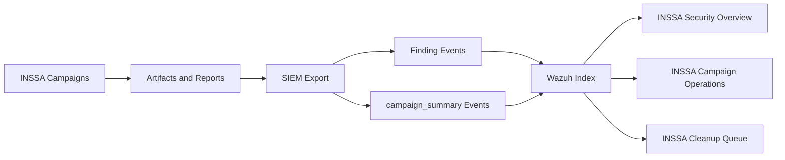

# INSSA Observability Dashboard

This document defines the dedicated Wazuh monitoring experience for INSSA QA security and lifecycle operations.

Scope:

```text
Dashboard and SIEM summary-event design.
No decoder, rule, ingestion service, or infrastructure redesign is included.
```

## Observability Architecture



Base filter for all dashboards:

```text
source:web-app-qa-tests AND product:INSSA
```

Primary time fields:

```text
timestamp
campaignSummary.startedAt
campaignSummary.completedAt
```

## Summary Event Schema

New event type:

```text
campaign_summary
```

Required fields:

| Field | Description |
| --- | --- |
| `campaign` | Campaign name: `security`, `cross-user`, `reveal-later`, `release-gate`. |
| `runId` | Campaign run identifier or stable release-gate identifier. |
| `status` | Normalized campaign status. |
| `critical` | Count of critical findings. |
| `high` | Count of high findings. |
| `medium` | Count of medium findings. |
| `low` | Count of low findings. |
| `duration` | Duration in milliseconds when start and completion timestamps exist. |
| `startedAt` | Campaign start timestamp when available. |
| `completedAt` | Campaign completion timestamp. |

The exported event also includes:

```text
eventType=campaign_summary
campaignSummary.*
dashboardFields.*
wazuh.rule.level
artifactReference
reportReference
```

## Campaign Summary Exports

Summary events are generated for:

| Campaign | Source |
| --- | --- |
| `security` | `security-campaigns/lifecycle-security.json` and run-specific `*-security.json` files. |
| `cross-user` | `security-campaigns/cross-user/latest-cross-user-verification.json`. |
| `reveal-later` | `security-campaigns/reveal-later/latest-reveal-later-security.json`. |
| `release-gate` | `docs/release-gate-gitignore-audit.md`. |

Generate:

```bash
npm run siem:export
```

Validate summary events:

```bash
node -e 'const j=require("./reports/siem/latest-siem-export.json"); console.log(j.events.filter(e=>e.eventType==="campaign_summary").map(e=>e.campaignSummary));'
```

## Dashboard: INSSA Security Overview

Purpose:

```text
Executive and security triage view for active risk.
```

Widgets:

| Widget | Type | Query | Metric |
| --- | --- | --- | --- |
| Critical Findings | Metric | `source:web-app-qa-tests AND product:INSSA AND rule.level >= 14` | Count |
| High Findings | Metric | `source:web-app-qa-tests AND product:INSSA AND rule.level >= 10` | Count |
| Open Findings | Metric | `source:web-app-qa-tests AND product:INSSA AND status:(failed OR warning OR passed-with-findings OR passed-with-warnings)` | Count |
| Findings By Severity | Donut or bar | `source:web-app-qa-tests AND product:INSSA` | Terms: `severity` |
| Findings By Classification | Horizontal bar | `source:web-app-qa-tests AND product:INSSA` | Terms: `classification` |
| Findings By Day | Date histogram | `source:web-app-qa-tests AND product:INSSA` | Count by `timestamp` |

Default time range:

```text
Last 30 days
```

Recommended refresh:

```text
5 minutes during active campaigns, 15 minutes otherwise
```

## Dashboard: INSSA Campaign Operations

Purpose:

```text
Operational health view for campaign execution trends and summary state.
```

Widgets:

| Widget | Type | Query | Metric |
| --- | --- | --- | --- |
| Security Campaign History | Data table | `eventType:campaign_summary AND campaign:security` | `completedAt`, `status`, `critical`, `high`, `medium`, `low`, `runId` |
| Cross User Campaign History | Data table | `eventType:campaign_summary AND campaign:cross-user` | `completedAt`, `status`, `critical`, `high`, `medium`, `low`, `runId` |
| Reveal Later Campaign History | Data table | `eventType:campaign_summary AND campaign:reveal-later` | `completedAt`, `status`, `critical`, `high`, `medium`, `low`, `runId` |
| Release Gate History | Data table | `eventType:campaign_summary AND campaign:release-gate` | `completedAt`, `status`, `medium`, `runId`, `reportReference.path` |
| Campaign Success Rate | Gauge or percentage metric | `eventType:campaign_summary` | Passed / total |
| Campaign Duration | Line chart | `eventType:campaign_summary AND campaignSummary.duration:*` | Average `campaignSummary.duration` by `campaign` |

Default time range:

```text
Last 90 days
```

Recommended refresh:

```text
15 minutes during active campaigns, manual otherwise
```

## Dashboard: INSSA Cleanup Queue

Purpose:

```text
Track QA-created staging data requiring manual cleanup.
```

Widgets:

| Widget | Type | Query | Metric |
| --- | --- | --- | --- |
| Capsules Pending Cleanup | Metric | `source:web-app-qa-tests AND product:INSSA AND (eventType:cleanup_audit OR classification:*cleanup* OR cleanupInstruction:*)` | Count |
| Cleanup Age | Date histogram or age table | `source:web-app-qa-tests AND product:INSSA AND (eventType:cleanup_audit OR classification:*cleanup*)` | Age from `timestamp` |
| Cleanup Status | Terms table | `source:web-app-qa-tests AND product:INSSA AND (eventType:cleanup_audit OR classification:*cleanup*)` | Terms: `status` |

Default time range:

```text
Last 90 days
```

Operational rule:

```text
Any cleanup target older than 7 days requires dev cleanup confirmation.
```

## Dashboard Filters

Global filters:

| Filter | Value |
| --- | --- |
| Source | `source:web-app-qa-tests` |
| Product | `product:INSSA` |
| Environment | `environment:staging` |

Campaign filters:

| Purpose | Filter |
| --- | --- |
| Campaign summaries only | `eventType:campaign_summary` |
| Security only | `campaign:security` |
| Cross-user only | `campaign:cross-user` |
| Reveal-later only | `campaign:reveal-later` |
| Release gates | `campaign:release-gate` |

Risk filters:

| Purpose | Filter |
| --- | --- |
| Critical | `rule.level >= 14` |
| High and critical | `rule.level >= 10` |
| Public-by-id | `classification:*public-by-id*` |
| Media public | `classification:*media-publicly-accessible*` |

## Validation

1. Run:

```bash
npm run siem:export
```

2. Confirm summary events exist:

```bash
node -e 'const j=require("./reports/siem/latest-siem-export.json"); console.log(j.events.filter(e=>e.eventType==="campaign_summary").length);'
```

3. Send to Wazuh:

```bash
SIEM_WAZUH_URL=https://wazuh.kbeanprobo.com/inssa SIEM_SEND_BATCH=1 npm run siem:send
```

4. In Wazuh Dashboard, filter:

```text
source:web-app-qa-tests AND product:INSSA AND eventType:campaign_summary
```

5. Confirm campaign summary rows exist for:

```text
security
cross-user
reveal-later
release-gate
```
