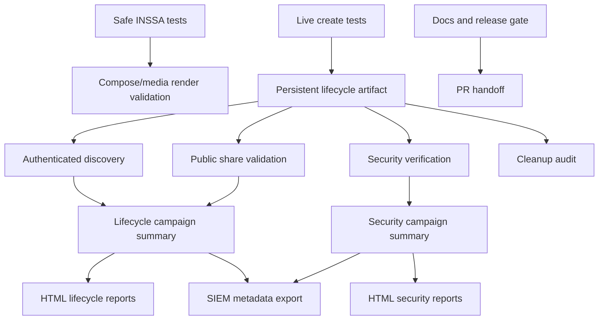

# INSSA QA Operations Guide

This is the primary entry point for operating the INSSA QA harness.

The repo is a Playwright QA harness for the hosted INSSA staging app. It is not the INSSA application source repository and has no backend, database, or cloud access.

Target:

```text
https://staging.inssa.us
```

Production live mutation/security lifecycle testing is blocked:

```text
https://inssa.us
```

## 1. Overview

The INSSA QA harness validates staging behavior through controlled black-box browser tests. Coverage now includes safe compose coverage, draft mutation coverage, live lifecycle campaigns, public-share validation, authenticated discovery diagnostics, cross-user validation, reveal-later validation, OWASP-aligned security checks, report generation, SIEM metadata export, and release-gate documentation.

Primary rules:

- Safe tests run without creating live capsules.
- Draft mutation tests require `INSSA_ENABLE_MUTATION_TESTS=1`.
- Live capsule tests require staging URL, live enablement, and manual cleanup acknowledgement.
- Media, video, reveal-later, and security input probes have additional explicit gates.
- Campaigns create at most one live staging capsule per run.
- Cleanup of live staging capsules remains manual until a scoped safe cleanup path is proven.
- Generated artifacts and reports stay ignored by git.

Related docs:

| Doc | Purpose |
| --- | --- |
| [INSSA Release Summary](inssa-release-summary.md) | PR/release handoff summary. |
| [Engineering Review](inssa-engineering-review.md) | Engineering-oriented lifecycle/security handoff. |
| [Security Findings](inssa-security-findings.md) | Detailed finding records. |
| [Risk Matrix](inssa-risk-matrix.md) | Risk and priority matrix. |
| [Live Staging Lifecycle Runner](inssa-live-staging-lifecycle.md) | Detailed lifecycle runner behavior. |
| [Security Campaign](inssa-security-campaign.md) | OWASP campaign architecture and output. |
| [Product Behavior Audit](inssa-product-behavior-audit.md) | Black-box staging product behavior map. |
| [Contact Share State Machine](inssa-contact-share-state-machine.md) | Current contact-share delivery flow. |
| [Gitignore Audit](release-gate-gitignore-audit.md) | Secrets/generated artifact release-gate audit. |
| [Current State](inssa-current-state.md) | Historical state summary; this guide is now authoritative. |

## 2. Architecture



Core locations:

| Area | Path |
| --- | --- |
| Page object | `pages/inssa/time-capsule.page.ts` |
| Safe tests | `tests/inssa/inssa-time-capsule-create.spec.ts`, `tests/inssa/us-compose-location-matrix.spec.ts`, `tests/inssa/media-step-capability.spec.ts` |
| Live lifecycle tests | `tests/inssa/live-capsule-*.spec.ts` |
| Security tests | `tests/inssa/security/` |
| Campaign scripts | `scripts/inssa/` |
| SIEM scripts | `scripts/siem/` |
| Persistent artifacts | `lifecycle-artifacts/` |
| Campaign outputs | `lifecycle-campaigns/`, `security-campaigns/` |
| Reports | `reports/lifecycle/`, `reports/security/`, `reports/siem/` |

## 3. Campaign Framework

Campaign Matrix:

| Campaign | Purpose | Risk | Output | Report |
| --- | --- | --- | --- | --- |
| `test:inssa:safe` | Non-mutating compose, USA matrix, and media capability baseline. | Low; no live capsule creation. | Playwright output and `test-results/`. | `playwright-report/` when generated. |
| `test:inssa:draft-mutations` | QA-tagged draft write/cleanup and draft restore audit. | Medium; draft-only staging mutation. | `test-results/`; draft cleanup diagnostics. | Playwright report. |
| `test:inssa:campaign:text` | One text live capsule lifecycle plus discovery/public-share. | High; creates one live staging capsule. | `lifecycle-artifacts/`, `lifecycle-campaigns/`. | `reports/lifecycle/latest-lifecycle-summary.html`. |
| `test:inssa:campaign:media` | One image live capsule lifecycle. | High; creates one live staging media capsule. | `lifecycle-artifacts/`, `lifecycle-campaigns/`. | `reports/lifecycle/latest-lifecycle-summary.html`. |
| `test:inssa:campaign:video` | One video live capsule lifecycle. | High; creates one live staging video capsule. | `lifecycle-artifacts/`, `lifecycle-campaigns/`. | `reports/lifecycle/latest-lifecycle-summary.html`. |
| `test:inssa:campaign:reveal-later` | One reveal-later live capsule lifecycle. | High; creates one scheduled live capsule. | `lifecycle-artifacts/`, `lifecycle-campaigns/`. | `reports/lifecycle/latest-lifecycle-summary.html`. |
| `test:inssa:campaign:security` | OWASP-aligned read-only security classification over staging and existing artifacts. | Medium; read-only, no capsule creation. | `security-campaigns/*.json`. | `reports/security/latest-security-summary.html`. |
| `test:inssa:campaign:security:verify` | Reproduces/classifies known security findings from artifacts. | Medium; read-only artifact-driven probes. | `security-campaigns/verification/latest-security-verification.json`. | `reports/security/security-verification.html`. |
| `test:inssa:campaign:cross-user` | Creates one targeted-contact capsule and validates User B access. | High; creates one live staging capsule. | `security-campaigns/cross-user/`. | `reports/security/cross-user-security.html`. |
| `test:inssa:campaign:reveal-later-security` | Creates/probes reveal-later pre-reveal and optional after-reveal behavior. | High; creates one scheduled live capsule. | `security-campaigns/reveal-later/`. | `reports/security/reveal-later-access-control.html`. |
| `siem:export` | Exports campaign metadata for SIEM. | Low; metadata-only local export. | `reports/siem/latest-siem-export.json`. | SIEM JSON export. |

Artifact Matrix:

| Artifact Type | Location | Producer | Consumer | Git Status |
| --- | --- | --- | --- | --- |
| Live lifecycle artifact | `lifecycle-artifacts/<runId>.json` | Live create specs and lifecycle campaigns | Discovery, public-share, security, cleanup audit | Ignored |
| Live lifecycle screenshot | `lifecycle-artifacts/<runId>.png` | Live create specs | Human review only | Ignored |
| Lifecycle campaign summary | `lifecycle-campaigns/<runId>-campaign-<type>.json` | Lifecycle campaign runner | Reports, SIEM export | Ignored |
| Security campaign JSON | `security-campaigns/*.json` | Security campaign runner | Reports, SIEM export | Ignored |
| Security verification JSON | `security-campaigns/verification/latest-security-verification.json` | Security verification campaign | Reports, SIEM export | Ignored |
| Cross-user JSON | `security-campaigns/cross-user/latest-cross-user-verification.json` | Cross-user campaign | Reports, SIEM export | Ignored |
| Reveal-later JSON | `security-campaigns/reveal-later/latest-reveal-later-security.json` | Reveal-later security campaign | Reports, SIEM export | Ignored |
| SIEM export | `reports/siem/latest-siem-export.json` | `npm run siem:export` | Wazuh/send step | Ignored |

## 4. Lifecycle Campaigns

Lifecycle campaigns are the preferred live-staging workflow. They avoid a single uncontrolled mega-suite by running one mutation phase and passing its exact artifact into downstream read-only phases.

Campaign flow:

```text
CREATE -> AUTHENTICATED DISCOVERY -> PUBLIC SHARE VALIDATION
```

Lifecycle campaign rules:

- One campaign run creates at most one live staging capsule.
- Campaigns use `INSSA_URL=https://staging.inssa.us`.
- Campaigns require explicit live flags and manual cleanup acknowledgement.
- Campaigns use one worker and zero retries for live creation phases.
- Downstream discovery/public-share phases consume the exact artifact from the create phase.
- Visibility warnings such as `share-link-only-visibility` do not hide retrieval failures; direct retrieval must still be proven.

Validated lifecycle campaign types:

| Lifecycle Campaign | Create Subject Prefix | Current Status |
| --- | --- | --- |
| Text | `QA_LIVE_CAPSULE_` | Validated with warnings. |
| Media | `QA_LIVE_MEDIA_CAPSULE_` | Validated with warnings. |
| Video | `QA_LIVE_VIDEO_CAPSULE_` | Validated with warnings. |
| Reveal-later | `QA_REVEAL_LATER_CAPSULE_` | Pre-reveal protection validated; after-reveal pending. |

## 5. Security Campaigns

Security coverage is black-box and evidence-based. It does not brute force credentials, run denial-of-service probes, exploit vulnerabilities, enumerate random object IDs, or test production.

OWASP coverage:

| OWASP Area | Coverage |
| --- | --- |
| A01 Broken Access Control | Tokenized/tokenless capsule routes, logged-out/authenticated access, cross-user visibility, reveal-later protection. |
| A02 Cryptographic Failures | HTTPS, HSTS, cookie flags, local/session storage sensitive indicators, token-in-URL behavior. |
| A03 Injection | Safe payload reflection/encoding checks; compose probes are explicitly gated. |
| A04 Insecure Design | Reveal-now/reveal-later semantics, share-link visibility, tokenless access, indexing behavior. |
| A05 Security Misconfiguration | Security headers, verbose errors, debug/environment leakage. |
| A06 Vulnerable and Outdated Components | Visible bundle/framework/version evidence only. |
| A07 Identification and Authentication Failures | Session persistence, logout, route guarding, stale session behavior. |
| A08 Software and Data Integrity Failures | Third-party resources, script integrity context, CSP observations. |
| A09 Security Logging and Monitoring Failures | Campaign traceability, artifact/reports/SIEM metadata. |
| A10 SSRF | Identification of visible URL/media import entry points only. |

## 6. Security Verification

Security verification consumes existing lifecycle artifacts and checks whether known findings still reproduce. It does not create capsules.

Latest verified areas:

| Verification Area | Current Result |
| --- | --- |
| Tokenless capsule access | Multiple `public-by-id` artifacts confirmed. |
| Media access | Public and authenticated-only media behaviors classified. |
| Reveal-later access | Latest pending artifact classified as `reveal-protected`; elapsed/unknown schedules are skipped or warnings. |
| Cross-user visibility aggregate | Existing artifacts include public-by-design/tokenless findings; dedicated contact-share campaign validates targeted delivery separately. |

Outputs:

- `security-campaigns/verification/latest-security-verification.json`
- `reports/security/security-verification.html`

## 7. Cross-User Validation

Cross-user validation creates one QA-tagged text capsule with the primary QA account, selects exactly the configured secondary QA contact, and verifies the secondary account can access the capsule through expected targeted surfaces.

Current dedicated result:

| Area | Classification |
| --- | --- |
| Isolation | `expected-share-access` |
| Route access | `isolated` |
| Surface access | `targeted-contact-surface-visible` |
| Media | `media-not-observed` |

Latest outputs:

- `security-campaigns/cross-user/latest-cross-user-verification.json`
- `reports/security/cross-user-security.html`

## 8. Reveal-Later Validation

Reveal-later validation follows the current staging behavior: Step 1 is timing-first and does not require `Shared capsule`.

Current model:

```text
Compose
-> Media / Add media & bury
-> Bury
-> Reveal settings
-> Reveal later
-> Continue
-> schedule/contact-share flow
-> pre-reveal access-control probes
```

Latest pre-reveal result:

| Area | Classification |
| --- | --- |
| Reveal protection | `reveal-protected` |
| Token behavior | `isolated` |
| Cross-user visibility | `isolated` |
| After-reveal | Pending scheduled follow-up |

Latest outputs:

- `security-campaigns/reveal-later/latest-reveal-later-security.json`
- `reports/security/reveal-later-access-control.html`

### Lifecycle Coverage Details

Current safe lifecycle baseline:

- Logged-out Bury redirects to sign-in with a time capsule `next` parameter.
- Authenticated Bury opens compose.
- Authenticated direct `/timecapsule?...` compose route renders.
- USA market compose routes seed expected subject/message defaults.
- Media step capability audit records visible media controls without upload.

Current live lifecycle model:

```text
Compose
-> Media / Add media & bury
-> Bury
-> Reveal settings
-> Reveal now or Reveal later
-> Continue
-> Send or save contact step
-> optional contact selection
-> Bury, then choose who to share with
-> success/share surface
```

Important staging behavior:

- Current Media UI may render as `Step 2: Add media & bury` with `Photo`, `Video`, `Gallery`, and `Bury`.
- Reveal-later Step 1 is timing-first and does not require `Shared capsule`.
- Current contact-share UI is `Send or save`, not the old `Skip contacts & share link with others` assumption.
- The top-level route may remain `/timecapsule` after success; success evidence can still be visible in the app surface.

Validated lifecycle outcomes:

| Lifecycle | Status |
| --- | --- |
| Draft write and draft cleanup | Validated behind mutation flag. |
| Draft restore fidelity | Product-side blocker documented; do not weaken test assertions. |
| Text live capsule | Validated with warnings. |
| Media live capsule | Validated with warnings. |
| Video live capsule | Validated with warnings using static fixture. |
| Contact-share delivery | Validated with secondary QA account. |
| Reveal-later creation | Validated with timestamp evidence. |
| Reveal-later pre-reveal protection | Validated for latest pending artifact. |
| Reveal-later after-reveal behavior | Pending scheduled follow-up. |

## 9. Reporting

Reports are generated under ignored local directories and should be handed off intentionally.

Report Matrix:

| Report | Location |
| --- | --- |
| Playwright HTML | `playwright-report/` |
| Latest lifecycle summary | `reports/lifecycle/latest-lifecycle-summary.html` |
| Lifecycle campaign reports | `reports/lifecycle/lifecycle-campaign-*.html` |
| Latest security summary | `reports/security/latest-security-summary.html` |
| Security verification | `reports/security/security-verification.html` |
| Cross-user security | `reports/security/cross-user-security.html` |
| Reveal-later access control | `reports/security/reveal-later-access-control.html` |
| SIEM export | `reports/siem/latest-siem-export.json` |

Open reports locally:

```bash
npm run report:show
npm run report:security
npm run report:lifecycle
```

Generated reports may link to local screenshots, traces, videos, and artifacts. Do not commit generated report directories unless a specific sanitized report is intentionally moved into `docs/`.

## 10. SIEM Integration

SIEM export is metadata-only. It excludes screenshots, videos, traces, and raw browser artifacts.

Supported event types:

- `release_gate`
- `lifecycle_campaign`
- `security_campaign`
- `discovery_campaign`
- `cleanup_audit`

Export command:

```bash
npm run siem:export
```

Send command:

```bash
npm run siem:send
```

Wazuh integration details are documented in [Wazuh INSSA QA Integration](wazuh-inssa-integration.md).

## 11. Release Gate Process

Release gate checklist:

1. Confirm git state and intended changed files.
2. Confirm `.gitignore` protects real env files, reports, traces, videos, screenshots, lifecycle artifacts, campaign artifacts, and local configs.
3. Confirm example env files contain placeholders only.
4. Run the safe suite:

```bash
npm run test:inssa:safe
```

5. Run security campaign:

```bash
npm run test:inssa:campaign:security
```

6. Run security verification:

```bash
npm run test:inssa:campaign:security:verify
```

7. Verify latest cross-user and reveal-later outputs exist.
8. Verify reports exist under `reports/security/`, `reports/lifecycle/`, and `reports/siem/`.
9. Export SIEM metadata:

```bash
npm run siem:export
```

10. Update release docs:

- [Release Summary](inssa-release-summary.md)
- [Engineering Review](inssa-engineering-review.md)
- [Security Findings](inssa-security-findings.md)
- [Risk Matrix](inssa-risk-matrix.md)
- This operations guide.

Release verdict definitions:

| Verdict | Meaning |
| --- | --- |
| PASS | Safe suite and required campaigns pass, no blocking secrets/safety failures. |
| PASS WITH WARNINGS | Harness is push-ready, but documented product findings/manual cleanup remain. |
| BLOCKED | Safe suite fails, secrets are exposed, production guard is broken, live tests run by default, artifact resolution is broken, or docs are missing. |

Current release verdict:

```text
PASS WITH WARNINGS
```

## 12. Cleanup Process

Do not auto-delete, archive, hide, edit, unpublish, or remove live capsules from tests unless a scoped safe cleanup path has been proven.

Current cleanup model:

- Draft cleanup is allowed only for exact QA-tagged drafts through the Buried drafts cleanup path.
- Live capsule cleanup is manual and development-team owned.
- Cleanup capability audit is read-only.

Latest cleanup targets:

| Source | Subject | Action |
| --- | --- | --- |
| Cross-user campaign | `QA_LIVE_CAPSULE_0d877454785d-c98ca92b0e_20260605T114055Z` | Dev team should delete from staging. |
| Reveal-later campaign | `QA_REVEAL_LATER_CAPSULE_b952b1d4fe53-c271b67d56_20260605T120726Z` | Dev team should delete after any after-reveal follow-up. |
| Historical lifecycle artifacts | See ignored `lifecycle-artifacts/*.json`. | Dev team should review QA-tagged staging data. |

Before rerunning a live create test after Bury/Continue was clicked, inspect the previous artifact and coordinate cleanup or intentional retention.

## 13. Known Findings

Current confirmed findings:

- Tokenless `/capsule/<id>` exposes exact revealed capsule content for many artifacts.
- Uploaded media has public accessibility cases.
- Revealed capsules are share-link accessible but generally not indexed in authenticated home/search/profile surfaces.
- Security headers are incomplete on staging.
- Live capsule cleanup remains manual.
- Draft restore fidelity remains product-side broken.
- Current contact-share flow uses targeted contact selection and `Bury, then choose who to share with`.
- Reveal-later pre-reveal access is protected for the latest scheduled artifact.

Policy decisions needed:

- Whether tokenless capsule access is intended.
- Whether media URLs should require token/auth.
- Whether revealed owner-created capsules should appear in feed/search/profile surfaces.
- What safe owner/admin cleanup path should exist for QA-created staging capsules.

Security finding table:

| Finding | Severity | Status | Owner |
| --- | --- | --- | --- |
| Tokenless `/capsule/<id>` exposes exact revealed capsule content. | High | Confirmed | Product/security engineering |
| Uploaded media has public accessibility cases. | High | Confirmed | Product/security engineering |
| Revealed capsules are share-link accessible but not generally indexed in home/search/profile surfaces. | Medium | Confirmed behavior, policy unclear | Product |
| Security headers are incomplete on staging. | Medium | Confirmed | Platform/app engineering |
| Live capsule cleanup remains manual. | Medium | Confirmed limitation | App/platform engineering |
| Sensitive-looking local storage entry requires review. | Low | Needs review | App/security engineering |
| Optional media/preview/network failures occur during successful lifecycle runs. | Low | Confirmed warning | App/platform engineering |
| Cross-user targeted contact delivery works through Messages. | Informational | Verified expected behavior | QA/product |
| Reveal-later pre-reveal access is protected for the latest scheduled artifact. | Informational | Verified pre-reveal | QA/product |

## 14. Known Risks

Known risks requiring product/security or operational follow-up:

- Tokenless capsule-by-ID access may be an intended sharing model or an access-control issue; product/security must decide.
- Media URL access policy needs confirmation.
- Manual cleanup remains required for live staging data.
- Reveal-later after-reveal validation remains pending for the latest scheduled artifact.
- Generated artifacts contain staging evidence and must remain ignored.
- Broad authenticated indexing semantics are unclear by product design.
- Draft restore fidelity remains a product-side blocker.

## 15. Command Reference

Command Matrix:

| Command | Purpose | Mutates Staging | Required Inputs |
| --- | --- | --- | --- |
| `npm run test:inssa:safe` | Safe non-mutating INSSA baseline. | No | `INSSA_TEST_EMAIL`, `INSSA_TEST_PASSWORD` |
| `npm run test:inssa:draft-mutations` | Draft write/cleanup and restore audit. | Draft-only | `INSSA_ENABLE_MUTATION_TESTS=1` |
| `npm run test:inssa:campaign:text` | Text live lifecycle campaign. | Yes | Live flags and cleanup approval |
| `npm run test:inssa:campaign:media` | Media live lifecycle campaign. | Yes | Live flags, media flag, location |
| `npm run test:inssa:campaign:video` | Video live lifecycle campaign. | Yes | Live flags, video flag, location |
| `npm run test:inssa:campaign:reveal-later` | Reveal-later live lifecycle campaign. | Yes | Live flags and reveal-later flag |
| `npm run test:inssa:campaign:security` | OWASP/security classification. | No | Existing artifacts recommended |
| `npm run test:inssa:campaign:security:verify` | Finding verification. | No | Existing artifacts |
| `npm run test:inssa:campaign:cross-user` | Primary-to-secondary contact-share validation. | Yes | Primary and secondary QA credentials |
| `npm run test:inssa:campaign:reveal-later-security` | Reveal-later access-control validation. | Yes | Reveal-later flags and QA credentials |
| `npm run siem:export` | Export metadata-only SIEM events. | No | Existing campaign/report outputs |
| `npm run siem:send` | Send metadata-only SIEM events. | No | Wazuh endpoint/token |

Safe baseline:

```bash
npm run test:inssa:safe
```

Live staging lifecycle:

```bash
npm run test:inssa:campaign:text
npm run test:inssa:campaign:media
npm run test:inssa:campaign:video
npm run test:inssa:campaign:reveal-later
```

Individual live specs:

```bash
npm run test:inssa:live-text
npm run test:inssa:live-media
npm run test:inssa:live-video
npm run test:inssa:reveal-later
```

Artifact-driven read-only checks:

```bash
npm run test:inssa:discovery
npm run test:inssa:public-share
npm run test:inssa:cleanup-audit
```

Draft mutation checks:

```bash
npm run test:inssa:draft-mutations
```

Security:

```bash
npm run test:inssa:campaign:security
npm run test:inssa:campaign:security:verify
npm run test:inssa:campaign:cross-user
npm run test:inssa:campaign:reveal-later-security
```

Reports:

```bash
npm run report:show
npm run report:security
npm run report:lifecycle
```

SIEM:

```bash
npm run siem:export
npm run siem:send
```

## 16. Troubleshooting

| Symptom | Likely Cause | Action |
| --- | --- | --- |
| Live test skips | Required live env flags missing. | Use `.env.inssa.live-staging` with explicit flags. |
| Production URL blocked | Safety guard is working. | Use `INSSA_URL=https://staging.inssa.us`. |
| Artifact-dependent test fails before browser launch | Missing/invalid artifact path. | Set `INSSA_LIVE_CAPSULE_ARTIFACT_PATH` or `INSSA_USE_LATEST_LIVE_CAPSULE_ARTIFACT=1`. |
| Safe suite fails on Media `Next step` | Staging may expose combined `Step 2: Add media & bury`. | Use current page helper behavior; do not click Bury in safe tests. |
| Google Maps vector fallback console message | Browser/third-party map fallback to raster. | Classified as non-fatal staging/browser noise. |
| Reveal-later test cannot find `Shared capsule` | Current Step 1 is timing-first. | Select `Reveal later`, Continue once, inspect Step 2. |
| Chromium MachPort/bootstrap crash | Local browser environment issue. | Rerun outside the affected sandbox; do not change tests to hide it. |
| Public share cannot run | Artifact lacks share-link/capsule URL evidence. | Use a finalized artifact with captured retrieval metadata. |
| Security campaign reports reveal-later skipped | Artifact reveal time elapsed or schedule unknown. | Create/use a future-scheduled reveal-later artifact. |

## Documentation Coverage Matrix

| Topic | Primary Section | Supporting Docs |
| --- | --- | --- |
| Project overview | This guide, Project Overview | [Current State](inssa-current-state.md), [Release Summary](inssa-release-summary.md) |
| Lifecycle architecture | This guide, Lifecycle Coverage | [Live Staging Lifecycle Runner](inssa-live-staging-lifecycle.md) |
| Campaign architecture | This guide, Campaign Matrix | [Live Staging Lifecycle Runner](inssa-live-staging-lifecycle.md), [Security Campaign](inssa-security-campaign.md) |
| Security architecture | This guide, Security Coverage | [Security Campaign](inssa-security-campaign.md), [Security Findings](inssa-security-findings.md) |
| Reporting | This guide, Reporting Process | [Release Summary](inssa-release-summary.md) |
| SIEM exports | This guide, SIEM Integration | `scripts/siem/`, `reports/siem/latest-siem-export.json` |
| Release gate | This guide, Release Process | [Gitignore Audit](release-gate-gitignore-audit.md), [Release Summary](inssa-release-summary.md) |
| Cleanup workflow | This guide, Cleanup Procedures | [Live Staging Lifecycle Runner](inssa-live-staging-lifecycle.md) |
| Artifact workflow | This guide, Campaign Matrix and Troubleshooting | [Live Staging Lifecycle Runner](inssa-live-staging-lifecycle.md) |
| Cross-user workflow | This guide, Cross-user campaign row | [Contact Share State Machine](inssa-contact-share-state-machine.md) |
| Reveal-later workflow | This guide, Lifecycle Coverage | [Product Behavior Audit](inssa-product-behavior-audit.md), [Release Summary](inssa-release-summary.md) |

## Documentation Gaps

- After-reveal reveal-later validation must be documented after the scheduled follow-up runs.
- Product/security owners should confirm tokenless capsule/media policy and update finding ownership/status.
- Cleanup workflow should be updated when a verified scoped live capsule cleanup path exists.
- If authenticated indexing semantics are clarified by product, update the lifecycle warning/pass criteria accordingly.
