# INSSA SIEM Architecture

This document defines the operational architecture for the INSSA QA to Wazuh telemetry path.

Related documents:

- [wazuh-inssa-ingestion.md](wazuh-inssa-ingestion.md)
- [wazuh-inssa-decoder.md](wazuh-inssa-decoder.md)
- [wazuh-inssa-rules.md](wazuh-inssa-rules.md)
- [inssa-siem-operations.md](inssa-siem-operations.md)
- [inssa-siem-runbook.md](inssa-siem-runbook.md)

## High-Level Architecture

```mermaid
flowchart LR
  QA["QA Campaign"] --> Export["SIEM Export"]
  Export --> Sender["send-to-wazuh.js"]
  Sender --> API["Ingestion API"]
  API --> Log["/var/ossec/logs/inssa-qa.log"]
  Log --> Collector["Wazuh Logcollector"]
  Collector --> Decoder["INSSA Decoder"]
  Decoder --> Rules["INSSA Rules"]
  Rules --> Indexer["Wazuh Indexer"]
  Indexer --> Dashboard["Wazuh Dashboard"]
```



Canonical flow:

```text
QA Campaign
-> SIEM Export
-> send-to-wazuh.js
-> Ingestion API
-> inssa-qa.log
-> Wazuh Logcollector
-> Decoder
-> Rules
-> Indexer
-> Dashboard
```

## Component Descriptions

| Component | Location | Responsibility |
| --- | --- | --- |
| QA Campaign | `tests/inssa/`, `scripts/inssa/` | Runs lifecycle, discovery, security, and release-gate checks against INSSA staging. |
| SIEM Export | `scripts/siem/export-campaign-summary.js` | Normalizes campaign outputs into metadata-only INSSA QA events. |
| Sender | `scripts/siem/send-to-wazuh.js` | Posts normalized events to the Wazuh ingestion endpoint. |
| Ingestion API | `services/inssa-ingestion/server.js` | Accepts JSON events at `POST /inssa`, validates schema, splits batches, and writes JSONL. |
| Nginx | `wazuh.kbeanprobo.com` | Terminates TLS and proxies `/inssa` to `127.0.0.1:8088/inssa`. |
| Event Log | `/var/ossec/logs/inssa-qa.log` | Durable JSONL input consumed by Wazuh Logcollector. |
| Logcollector | Wazuh native install | Reads `inssa-qa.log` as JSON localfile input. |
| Decoder | `/var/ossec/etc/decoders/local_decoder.xml` | Identifies `source=web-app-qa-tests` and `product=INSSA` events. |
| Rules | `/var/ossec/etc/rules/local_rules.xml` | Maps classifications to Wazuh levels and alert groups. |
| Indexer | Wazuh indexer | Stores normalized alert documents. |
| Dashboard | Wazuh dashboard | Shows security findings, lifecycle status, release gates, and cleanup targets. |

## Data Flow

1. A QA operator runs an INSSA campaign or release-gate command.
2. Campaign outputs are written under `lifecycle-campaigns/`, `security-campaigns/`, `reports/`, and `docs/`.
3. `npm run siem:export` reads those outputs and writes `reports/siem/latest-siem-export.json`.
4. `npm run siem:send` posts either individual events or a batch payload to `https://wazuh.kbeanprobo.com/inssa`.
5. Nginx forwards the request to the local ingestion service.
6. The ingestion service validates `schemaVersion: inssa-qa-siem.v1`, `source: web-app-qa-tests`, and `product: INSSA`.
7. Accepted events are appended as one JSON object per line to `/var/ossec/logs/inssa-qa.log`.
8. Wazuh Logcollector reads the JSONL log.
9. The custom INSSA decoder extracts fields.
10. The custom INSSA rules classify risk and trigger dashboard entries or alerts.

## Event Shape

Minimum event fields:

```json
{
  "schemaVersion": "inssa-qa-siem.v1",
  "source": "web-app-qa-tests",
  "product": "INSSA",
  "eventType": "security_campaign",
  "timestamp": "2026-06-06T00:00:00.000Z",
  "campaign": "security",
  "environment": "staging",
  "severity": "high",
  "classification": "public-by-id",
  "status": "warning"
}
```

Supported event types:

| Event Type | Source |
| --- | --- |
| `release_gate` | Release-gate audit reports. |
| `lifecycle_campaign` | Text, media, video, reveal-later lifecycle campaigns. |
| `security_campaign` | OWASP, verification, cross-user, reveal-later security campaigns. |
| `discovery_campaign` | Authenticated and public retrieval checks. |
| `cleanup_audit` | Cleanup capability and manual cleanup tracking. |

## Trust Boundaries

| Boundary | Trust Shift | Control |
| --- | --- | --- |
| QA runner to network | Local campaign output leaves the QA workstation. | `send-to-wazuh.js` sends metadata only and blocks media references and unredacted tokens. |
| Internet to Wazuh host | Public TLS endpoint receives events. | Nginx terminates TLS and should restrict source IPs where possible. |
| Nginx to service | Local reverse proxy forwards to Node service. | Service binds to `127.0.0.1:8088`. |
| Service to Wazuh log file | HTTP request becomes local JSONL. | Schema validation, payload limit, request logging, and failure logging. |
| Logcollector to rules | JSONL becomes Wazuh alert data. | Custom decoder and rules match known source, product, and classifications. |
| Dashboard to operators | Alerts become operational decisions. | Runbooks define validation, escalation, and resolution paths. |

## Failure Points

| Failure Point | Symptom | Detection Command | Recovery Path |
| --- | --- | --- | --- |
| QA export missing | `npm run siem:send` generates or cannot find export. | `ls -l reports/siem/latest-siem-export.json` | Run `npm run siem:export`. |
| Sender endpoint missing | Sender exits with endpoint configuration error. | `npm run siem:send -- --dry-run` | Set `SIEM_WAZUH_URL=https://wazuh.kbeanprobo.com/inssa`. |
| Nginx route down | `curl` to HTTPS endpoint fails or returns 502. | `curl -i https://wazuh.kbeanprobo.com/inssa` | Validate Nginx config and service status. |
| Ingestion service down | Nginx returns 502, local health check fails. | `sudo systemctl status inssa-ingestion --no-pager` | Restart service, inspect journal. |
| Wazuh event log not writable | Service returns 500 or request log shows internal error. | `sudo tail -n 50 /var/ossec/logs/inssa-qa-ingestion-errors.log` | Fix permissions on `/var/ossec/logs/inssa-qa.log`. |
| Logcollector not reading | Event log grows but dashboard has no events. | `sudo tail -n 100 /var/ossec/logs/ossec.log` | Verify Wazuh localfile config and restart manager. |
| Decoder broken | Events ingested but not classified as INSSA. | `sudo /var/ossec/bin/wazuh-logtest` | Restore decoder XML and restart Wazuh. |
| Rules broken | Decoder works but alert levels/groups missing. | `sudo /var/ossec/bin/wazuh-logtest` | Restore rules XML and restart Wazuh. |
| Indexer/dashboard issue | Wazuh alerts exist but dashboard does not show them. | Check Wazuh dashboard and indexer health. | Restart dashboard/indexer following Wazuh recovery procedure. |

## Recovery Paths

Fast recovery order:

1. Verify ingestion service: `sudo systemctl status inssa-ingestion --no-pager`.
2. Verify local health: `curl -s http://127.0.0.1:8088/healthz`.
3. Verify Nginx: `sudo nginx -t` and `sudo systemctl status nginx --no-pager`.
4. Verify event log append: `sudo tail -n 5 /var/ossec/logs/inssa-qa.log`.
5. Verify Wazuh manager: `sudo systemctl status wazuh-manager --no-pager`.
6. Verify decoder and rules with `sudo /var/ossec/bin/wazuh-logtest`.
7. Verify dashboard by filtering for `source:web-app-qa-tests` and `product:INSSA`.

Durable recovery references:

- Decoder and rule restore: [inssa-siem-disaster-recovery.md](inssa-siem-disaster-recovery.md)
- Operational validation: [inssa-siem-operations.md](inssa-siem-operations.md)
- Release gate: [inssa-siem-release-gate.md](inssa-siem-release-gate.md)
