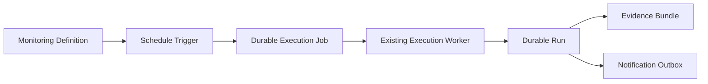

# Monitoring Framework

## Purpose

The Monitoring Framework defines how QA campaigns may be observed over time. It is a reusable metadata subsystem for INSSA, Localman, KBean, and future products.

The framework defines monitor policy and schedule metadata. Phase 8 adds a separate scheduler trigger that evaluates enabled schedule definitions and enqueues durable jobs. It does not execute campaigns or deliver notifications.

Only `schedule` triggers are active. Manual, API, deployment, webhook, and future trigger values remain descriptive contracts.

## Definition Model

| Field | Purpose |
| --- | --- |
| `id`, `name` | Durable identity and operator-facing name |
| `product`, `campaignId`, `environment` | Product-aware campaign target |
| `triggerType` | Declarative source: manual, schedule, API, deployment, webhook, or future |
| `enabled` | Whether the definition is eligible for a future trigger engine |
| `severity` | Operational importance of the observation |
| `schedule` | Nullable hourly, daily, or weekly schedule with an IANA timezone |
| `notificationPolicy` | Critical, warning, info, or silent configuration only |
| `retryPolicy` | Future maximum-attempt and backoff configuration |
| `timeout` | Future execution timeout in milliseconds |
| `evidencePolicy` | Always, on failure, or never |
| `runPolicy` | One active run, allow parallel, queue, skip, or retry |
| `createdAt`, `updatedAt`, `schemaVersion` | Audit and compatibility metadata |

## Trigger Model

Supported trigger values are:

- `manual`
- `schedule`
- `api`
- `deployment`
- `webhook`
- `future`

The scheduler evaluates only enabled definitions whose trigger type is `schedule`. There is no webhook receiver, deployment hook, cron expression parser, or trigger execution for the other values.

The scheduled catalog includes a daily staging Safe Suite and midday staging [Authentication Monitoring](./authentication-monitoring.md). Production midday and evening authentication definitions are provisioned disabled until production-specific credentials and confirmation are configured.

## Run Policy

- `one_active_run`: a future trigger must respect the platform's single active execution rule.
- `allow_parallel`: configuration reserved for campaigns proven safe for parallel execution.
- `queue`: a future trigger may wait behind active work.
- `skip`: a future trigger may be ignored when it cannot run immediately.
- `retry`: a future trigger may apply the associated retry policy.

The scheduler respects the existing one-active-run safety boundary. Other policy values remain modeled for future phases and do not enable parallel execution.

## Evidence Policy

- `always`: preserve evidence for every future run.
- `on_failure`: preserve evidence for failed future runs.
- `never`: do not retain campaign evidence through the monitoring policy.

The current evidence pipeline is unchanged and does not read these definitions.

## Notification Policy

- `critical`
- `warning`
- `info`
- `silent`

The policy is configuration only. It does not create Notification Outbox events and cannot deliver notifications.

## Persistence

The framework follows the platform metadata backend selection:

- Local fallback: `dashboard/.data/monitoring-definitions.json`
- Supabase: `monitoring_definitions`
- Schema version: `1`

The local store initializes a small product-aware catalog atomically under the existing inter-process file lock. The Supabase migration seeds the same definitions idempotently. The table has RLS enabled and is accessible only through the server-side service role.

The monitoring migration follows the core, execution, and outbox migrations. See [Migration Guide](./supabase-migration-guide.md).

## Read-Only API

All routes require the existing `viewer` or higher API guard:

- `GET /api/monitoring-definitions`
- `GET /api/monitoring-definitions/:id`

List filters include product, campaign, environment, trigger type, severity, and enabled state. Offset cursor pagination is supported with a maximum page size of 100. There are no create, update, delete, trigger, retry, or execute routes.

## Dashboard

The Monitoring workspace displays:

- Monitor name and ID
- Derived definition status
- Product
- Campaign
- Environment
- Trigger type
- Enabled state
- Evidence policy
- Notification policy
- Run, retry, and timeout summary

The workspace is read only. Its Scheduler Status card shows service health and queue activity without providing controls.

## Safety Boundary

The monitoring definition subsystem remains independent of:

- The execution worker
- Campaign execution and worker implementation
- Campaign scripts and Playwright
- Evidence creation and storage
- Notification event generation and delivery

The scheduler consumes definitions through an explicit adapter and writes only to the durable execution queue. See [Scheduler Trigger](./scheduler-trigger.md).
