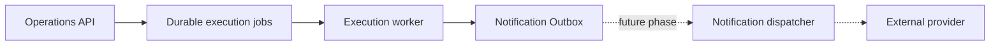

# Notification Outbox

## Purpose

The Notification Outbox is the durable boundary between platform execution and future notification delivery. Execution records notification intent; it never contacts email, SMS, Slack, Teams, webhook, or push providers.



This phase stops at the outbox. No dispatcher is instantiated and no external notification is sent.

## Persistence

The outbox follows the execution foundation's metadata backend selection:

- `INSSA_OPS_METADATA_STORE=supabase` uses the `notification_outbox` table through the server-side Supabase service credential.
- Any other setting uses `dashboard/.data/notification-outbox.json` with an inter-process file lock and atomic replacement.
- Both formats carry `schemaVersion: 1`.
- A unique `deduplicationKey` makes event creation idempotent across request retries, worker retries, and recovery.

Outbox persistence is best-effort from the campaign's perspective. A write failure is logged to worker stderr but cannot change a test result or cause direct provider delivery.

## Event Model

Each record contains:

| Field | Purpose |
| --- | --- |
| `id`, `createdAt`, `schemaVersion` | Durable identity and format version |
| `runId`, `campaignId`, `correlationId` | Execution and diagnostic relationships |
| `product`, `environment` | Product and target context |
| `eventType`, `severity`, `title`, `message`, `payload` | Event classification and redacted details |
| `status`, `attemptCount`, `lastAttemptAt` | Delivery lifecycle state |
| `deliveredAt`, `provider`, `providerMessageId`, `errorMessage` | Reserved delivery outcome fields |
| `deduplicationKey` | Storage-enforced idempotency |

Supported statuses are `pending`, `processing`, `delivered`, `failed`, and `dead_letter`. New events start as `pending`; no component in this phase advances them.

Supported event types:

- `run_queued`
- `run_started`
- `run_completed`
- `run_failed`
- `worker_restarted`
- `worker_lease_expired`
- `job_recovery`
- `evidence_upload_failed`
- `execution_failed`

## Lifecycle

1. The API creates a run and durable execution job.
2. A `run_queued` event is inserted only after enqueue succeeds.
3. The worker acquires the lease and inserts `run_started`.
4. Terminal run persistence inserts either `run_completed` or `run_failed`.
5. An unexpected worker exception inserts `execution_failed` in addition to the terminal run event.
6. Durable evidence upload failure inserts `evidence_upload_failed`; the run retains its existing warning behavior.
7. Worker startup inserts `worker_restarted`.
8. Lease recovery inserts `worker_lease_expired` and `job_recovery` after the job is durably requeued or abandoned.

## Deduplication

Deduplication keys encode the immutable execution transition:

- Run events use the run ID and transition.
- Run-start events also include the execution attempt.
- Recovery events use the job ID and attempt.
- Worker startup uses the unique worker instance ID.
- Evidence upload failure uses the run and bundle IDs.

Local persistence checks the key while holding the file lock. Supabase enforces a unique index and uses conflict-safe insertion. Duplicate calls return the existing event.

## Read-Only API

All endpoints require the existing `viewer` or higher API guard.

### `GET /api/notifications`

Returns newest-first events and pagination metadata. Optional query parameters:

- `status`
- `severity`
- `campaign`
- `environment`
- `product`
- `run`
- `cursor` as a zero-based offset
- `limit` from 1 to 100

### `GET /api/notifications/:id`

Returns one event or `404`.

There are no create, update, retry, or send API routes.

## Dashboard

The Notification Outbox workspace is read only. It shows status totals, severity and status filters, time, run, campaign, environment, product, event type, and message. Run references navigate to the existing Run workspace. It intentionally has no send or retry control.

## Dispatcher Contract

`NotificationDispatcher` defines the future provider boundary:

```text
NotificationDispatcher
  provider
  deliver(notification) -> delivered/providerMessageId or error
```

The lifecycle contract reserves claiming pending records and marking delivered, failed, or dead-letter outcomes. Provider adapters will be implemented in a separate approved phase. The execution worker must not import or invoke a dispatcher.

## Failure Handling

- Outbox insert failures are written to stderr and do not fail campaign execution.
- Delivery attempts are absent in this phase, so `attemptCount` remains zero.
- A future dispatcher will use bounded attempts, record the provider error, and move exhausted records to `dead_letter`.
- Dead-letter events remain durable for operator review and require an explicitly designed retry workflow.
- Payloads, titles, and messages pass through the existing secret-redaction function before persistence.

## Supabase Deployment

Apply `dashboard/supabase/migrations/20260722_notification_outbox.sql` after the core and execution-foundation migrations. The migration owns only the outbox table, constraints, filter indexes, RLS, and service-role-only access. Execution claim/recovery RPCs are owned by the execution-foundation migration.

## Certification Boundary

This subsystem is certified when local and Supabase persistence pass schema validation, duplicate event creation remains idempotent, authenticated read APIs build, completed and failed runs generate records, worker recovery generates records, and existing execution/evidence/report behavior remains unchanged. External delivery is explicitly outside this certification.
