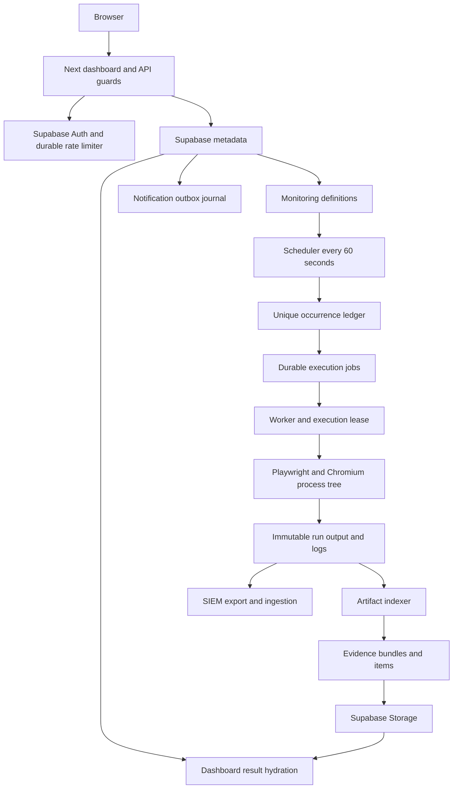

# QA Operations Platform stabilization baseline — September 2026

Audit date: 14 September 2026. Production observations were taken on that date; database/storage inventory is timestamped 11:34 UTC (12:34 Europe/Dublin). Later verification samples are identified below. Byte values are decimal bytes unless stated otherwise.

**STABILIZATION BASELINE PARTIALLY BLOCKED. Production health: AMBER.**

This is the requested first deliverable: a factual baseline and proposed, ordered changes before application implementation. No application source, dependency lockfile, migration, production record, schedule, deployment setting, or retention setting was deliberately changed. Existing dashboard GET requests do perform cleanup-ledger synchronization; that pre-existing side effect is a finding below. The authorized Safe/Playwright baseline ran against staging. No mutation campaign sweep, production data repair, evidence deletion, or deployment was performed.

The strongest immediate findings are a failing production dependency audit, failed-run evidence excluded from durable upload, and excessive repeated metadata access. Core execution and schedule consistency checks passed at the snapshot. The complete sprint is not certified: live session lifecycle coverage, authenticated browser performance capture, process-level resource peaks, and a hold-aware retention dry run remain outstanding.

The companion [measurements JSON](platform-stabilization-measurements-2026-09.json) contains sanitized observations, advisory results, query statistics, CI timing, and an **age-only retention projection**. It is not an executable deletion plan. Historical QA identities, credentials, full logs, and raw evidence contents are excluded.

## A. Executive status

Scores are engineering judgments about the observed baseline, not calculated SLOs. Scale: 10 means fully evidenced and operationally complete; 5 means functioning with material gaps; 0 means unusable. Unmeasured behavior does not receive a passing certification.

| Dimension | Score /10 | Basis |
|---|---:|---|
| Overall | 6 | Live core works; storage reliability, dependency, and certification gaps remain |
| Stability | 7 | Consistent terminal jobs/runs, fresh scheduler, passing subsystem tests; hosted Safe failure and local-only failure evidence |
| Performance | 6 | Small database and fast individual SQL; repeated HTTP queries, terminal polling, and result fan-out |
| Storage hygiene | 4 | Private, verified uploaded objects; no retention/holds engine, local-only failures, four unreferenced objects |
| Security | 6 | Server-side authorization, RLS and rate-limit tests pass; current Next/sharp production audit fails |
| Maintainability | 7 | Clear subsystem boundaries and focused tests; duplicated metadata work and overlapping documentation |

No confirmed P0 outage or compromise was established. Dependency advisories are urgent P1 release blockers; their presence alone does not establish exploitation.

## Frozen release and runtime identity

| Item | Observed baseline |
|---|---|
| Repository | `davidfrank96/web-app-qa-tests--main` |
| Local branch | `fix/governed-mutation-readiness` |
| Local HEAD | `481a6146c0661118c84b0b25c76d52fa3c1eb11b` |
| Remote main, verified with `git ls-remote` | `2c289bc2ed4a3308122784bc5ece6fed4a452fea` |
| Source comparison | Local HEAD and remote main have identical source trees (`git diff` empty), despite different commit identities |
| Initial working tree | Clean; report files are the only intended changes from this audit |
| DigitalOcean app | `kbean-qa-webapp`, `25bef95b-e762-4675-b850-65794c62aa10` |
| Live deployment | `6101d465-b82a-419b-a1cd-ec9815b2147a`, successful, 17 August 2026 11:25:10 Europe/Dublin |
| Deployed source | DO component settings display `2c289bc`, main, matching the verified remote main commit |
| Public origin | `https://kbean-qa-webapp-2ok9x.ondigitalocean.app` |
| Runtime topology | One web service/container; supervisor launches Next web, worker, and scheduler |
| Instance | LON1, 2 GB RAM, 1 shared vCPU, 200 GB bandwidth allowance; displayed $25/month |
| Build image | Ubuntu 22.04 buildpack |
| Local Node / TypeScript | Node 22.23.2; root TypeScript 6.0.3. Exact running production Node patch was not obtained |
| Installed Next / React | Next 15.5.22; React 19.2.5 |
| Installed Playwright | 1.59.1 |
| Installed Supabase libraries | `@supabase/ssr` 0.12.0; `@supabase/supabase-js` 2.108.0 |
| Metadata | Supabase project `qdrhzdulhlkjhckosdrv` |
| Evidence | Private Supabase Storage bucket `inssa-evidence`; local immutable run output before upload |
| Migrations | All 14 repository migrations match the applied inventory; versions listed in appendix |
| Autodeploy | Enabled on main; no setting changed |

DO build command: `npm ci && npm --prefix dashboard ci && npx playwright install chromium && npm run dashboard:build`. Run command: `npm run dashboard:start`. The observed live deployment took 2m48s total build time, with 1m8s billable build time displayed.

## Architecture traced through source and hosted state

| Subsystem | Classification | Source + observed evidence / limit |
|---|---|---|
| Next web / deployment | HEALTHY | DO live; `/login` and `/api/health` 200 throughout 20-request samples |
| Browser operations client | PARTIAL | Authenticated views load; terminal detail polling and workspace fan-out confirmed in code; old auth rows show “Not loaded” |
| Auth/session | UNDER-TESTED | Existing admin session works; hardened source/unit suite passes; fresh login→refresh→logout→relogin→expiry sequence not completed |
| API guard / RBAC | HEALTHY within tested scope | Verified-user authorization, request-origin checks, UUID validation, server-controlled roles and regression tests |
| Supabase metadata | HEALTHY at snapshot | Correct project queried directly; consistency joins and table access checks passed |
| Monitoring definitions | HEALTHY | Eight definitions; desired staging and disabled production schedules confirmed |
| Scheduler | HEALTHY | At 11:58:11 UTC, running=true, heartbeat 11:57:32, last_error=null; three scheduled definitions evaluated |
| Occurrence ledger | HEALTHY | 102 unique occurrences, no duplicate occurrence keys; “queued” denotes successful dispatch handoff |
| Durable jobs / worker | HEALTHY with efficiency gap | 113 jobs, none active at snapshot; lease/recovery/process tests pass; measured idle reads excessive |
| Playwright / Chromium | DEGRADED in hosted Safe history | Fresh local 13/13 pass; today's hosted Safe run failed on staging Firebase “Document already exists” |
| Output and artifact indexing | PARTIAL | 6,378 artifacts; no orphan run references; five terminal runs have no bundle |
| Evidence bundles / upload | DEGRADED | 96 uploaded bundles intact; 12 failed-run bundles local-only because upload is success-gated |
| Storage | PARTIAL | Private bucket; all uploaded references exist with matching size, sampled checksums pass; no retention engine |
| Hydration / result projection | PARTIAL | Recent auth results resolve; first-20 fan-out leaves older rows unloaded; monitoring state refreshed only on workspace entry |
| Notification outbox | PARTIAL | Intent journal persists; 512 pending, zero attempts, no running dispatcher implementation |
| SIEM | PARTIAL | Export/ingestion security tests pass; fresh end-to-end Wazuh delivery not performed in this audit |
| Cleanup governance | PARTIAL | Ten unresolved `cleanup_unavailable` records intentionally block unsafe assumptions; staging/admin/preflight controls retained |
| Public dependency health | PARTIAL | Health route reports supervisor PID and web, not actual DB or separate worker/scheduler heartbeat health |

No subsystem is classified OVER-COMPLEX merely because its file is large. No confirmed currently broken end-to-end core path was inferred from documentation alone.

## B. Top ten findings and proposed changes

| Rank / priority | Issue and evidence | Risk / impact | Proposed fix | Size / regression risk |
|---|---|---|---|---|
| 1 / P1 | Dashboard production audit: Next 15.5.22 critical, sharp 0.35.0 high; fresh audit exit 1 | Security release gate fails; image decoder advisory may apply depending on input reachability | Update Next to audited compatible patch (audit offers 15.5.25), update explicit sharp override to at least 0.35.4, regenerate lock, rerun gates | Small; medium runtime compatibility risk |
| 2 / P1 | `runner.ts:395` uploads only when `exit.code === 0 && !timedOut && !leaseLost`; all 12 local-only bundles belong to failed runs, 344,429,165 declared bytes | Failure evidence depends on ephemeral container files; redeploy/restart can remove it | Persist failed/timed-out evidence after verified process termination and valid worker ownership; add failure-path upload regression and explicit unrecoverable/retry status | Small–medium; medium lease/process safety risk |
| 3 / P1 | Supabase `replaceRunEvidence` deletes items/bundle then reinserts in separate requests; 5,845 item deletions and 96 bundle deletions in statistics match upload re-publication | Partial failure can leave a missing manifest or inconsistent metadata; no mismatch observed now | Atomic metadata publication/upsert transaction, then update upload fields without replacing unchanged records | Medium; medium schema/compatibility risk |
| 4 / P1 | Retention classes exist, but no evaluator, durable holds, plan certification, tombstones, or execution mechanism | Unbounded evidence growth; any naive age purge could destroy failure/security/cleanup evidence | Implement hold-aware, versioned plan and compact admin review first; production dry run only | Medium; high consequence if deletion enabled prematurely |
| 5 / P1 | Public health checks supervisor process existence only; no dependency probe or evidence mode; DO has no configured component liveness check/alerts | Healthy-looking endpoint can conceal DB/heartbeat/upload failures | Cheap bounded/cached DB reachability and separate heartbeat/evidence summaries; alert on observed operational failures | Small–medium; low–medium false-alarm risk |
| 6 / P2 | Idle worker made 474 job reads in 255.941s (111.12/min); roughly 2.75m cumulative reads for each of claim/recovery shapes | Avoidable HTTP/database traffic and idle work, despite cheap individual queries | Bounded adaptive idle backoff; preserve lease 120s, heartbeat 15s, failure threshold, recovery correctness | Small; medium job-start/recovery latency risk |
| 7 / P2 | `GET /api/cleanup-ledger` synchronizes configured records, then runs repeated readiness checks; 8,336 cleanup upsert calls for ten rows | Viewing a page writes repeatedly; static synchronization risks overwriting later durable resolution | Move configured seeding to explicit initialization/migration; share read-only readiness snapshot while preserving launch-time revalidation | Small–medium; medium cleanup policy risk |
| 8 / P2 | Main client polls terminal run detail every 15s (four endpoints), plus runs; Notifications polls every 5s even when hidden | Extra traffic, repeated immutable JSON/manifest transfer | Cache terminal data by run/version, fetch active details selectively, suppress hidden noncritical polling, deduplicate in-flight reads | Small–medium; medium stale-state risk |
| 9 / P2 | Run list full-fetch + three exact counts; logs cursor applied after full database fetch; auth up to 20×4 metadata queries; Reports up to 40 artifacts then 40 evidence requests | N+1 traffic and future PostgREST row-cap truncation; repeated serialization | Database cursor pagination and incremental logs; batch compact run projections and fetch selected evidence on demand | Medium; medium ordering/cache/RBAC risk |
| 10 / P2 | Monitoring/scheduler UI refreshes on workspace entry only; 512 notifications remain pending with attempts=0 in journal-only design | Stale schedule status and a misleading permanent delivery backlog | Visibility-aware status refresh; explicit journal/dispatcher-disabled presentation; separate reviewed terminal-history policy | Small–medium; low–medium semantics risk |

Advisory basis: [Next AVIF image-optimization advisory](https://github.com/vercel/next.js/security/advisories/GHSA-2xp9-vwfh-vxw4), [sharp/libheif advisory](https://github.com/lovell/sharp/security/advisories/GHSA-rgj7-g3m4-5g8c). Next's separate [Windows-hosted advisory](https://github.com/advisories/GHSA-p293-qw3h-jr36) does not describe the observed Linux host. Do not claim an exploit path or compromise from the package audit alone. Fix both the Next dependency and the explicit sharp override; updating Next alone can preserve the vulnerable override.

Additional reliability follow-up: investigate the hosted Safe suite's intermittent staging draft-autosave collision while retaining its assertions. That external application error is not grounds to weaken this repository's tests or modify another service. The “non-destructive compose surface” label describes test intent; hosted logs show that entering the compose flow can still trigger the staging application's autosave.

## Current warning/degraded state register

This table covers inspected hosted views and durable records; it is not a claim that every possible empty-state branch was exercised.

| Subsystem | Current state and exact cause | User / operational impact | Priority | Fix required / type |
|---|---|---|---|---|
| Authentication Monitoring: username/password | Latest scheduled result PASS, 43.8s | Locked routine check currently succeeds | Preserve | Regression only |
| Google provider | BLOCKED-PROVIDER; hosted browser rejected as insecure by provider, 30.3s | Google check unavailable; worker/scheduler still operate | Expected provider state | Preserve scoped provider semantics; no infrastructure “repair” |
| Apple provider | MISSING CONFIG, 10.2s | Provider check not ready | Configuration | Optional provider setup, separate from platform health |
| Auth aggregate | `passed_with_warnings`, provider view degraded | Honest provider limitation | Expected | Keep distinct from infrastructure status |
| Older auth history | “Not loaded”; client fetches first 20 of 68 runs | Older provider results unavailable without better lazy loading | P2 | Query/UI hydration |
| Latest hosted Safe run | `failed`; Firebase “Document already exists” during compose/media/default-location flow, including retry | Daily Safe baseline not reliably green | P1 investigation | Reproduce and attribute staging autosave/test isolation; preserve failure |
| Evidence | 12 bundles / 533 items `local_only`, success-only upload condition | Failed evidence may disappear with container | P1 | Upload and recovery behavior |
| Five terminal runs | No evidence bundle (four failed, one failed_startup) | Incomplete forensic output; absence is not success | P1 investigation | Reconcile only if output exists; otherwise record unavailable reason |
| Cleanup | Ten `cleanup_unavailable` records, no resolved record | Live objects require governance and retention protection | Protected state | Keep unresolved; do not mark resolved by age |
| Notifications | 512 pending since 10 August; attempts=0, provider=null, dispatcher interfaces only | Journal looks like indefinitely queued delivery | P2 | Explicit journal mode and separate history policy |
| Production auth schedules | Disabled | Intentional absence of production checks | Expected | Keep disabled |
| Disabled security/deployment/API monitor definitions | Not running by configuration | No data expected for those triggers | Expected | Do not enable during optimization |
| Scheduler occurrence status | 102 `queued` entries, linked to completed/failed jobs | Dispatch history, not 102 stuck executions | Healthy semantic | Do not relabel as execution failures |
| Scheduler heartbeat | Fresh and running; no last error | Healthy at snapshot | Preserve | Improve UI freshness and health exposure |
| Evidence retention | No engine / not certified | No automatic reclaim capability | P1 | Plan and holds first |
| Supabase security advisor | Leaked password protection disabled | Additional password protection absent | P2 hardening | Review available Auth setting; no billing/plan change in audit |
| Unreferenced storage | Four objects from July 13, 1,107,350 bytes | Small unexplained residuals | P2 investigation | Establish provenance; exclude from automatic age plan |

Latest auth run: `c396fc6a-40c6-4848-93c3-db7cf1984b10`, 11:00:36–11:02:38 UTC on September 14, approximately 122s end-to-end. Provider execution totals 114.2s. Latest hosted Safe run: `29ba5d74-400e-4e51-8c73-cb9210654416`, 02:00 UTC (03:00 Dublin), 508.6s, failed. A direct browser attempt to open its report was blocked by the browser client; this audit does not establish whether the old local file is still recoverable.

## History and result integrity

| Check | Result |
|---|---|
| Runs | 113: 96 passed_with_warnings, 16 failed, 1 failed_startup; zero active |
| Jobs | 113: 96 completed, 13 failed, 4 abandoned |
| Terminal job with active run | 0 |
| Duplicate job run IDs / occurrence keys | 0 / 0 |
| Orphan artifact/run or evidence/run/bundle references | 0 |
| Bundle item count / byte-total mismatch | 0 |
| Uploaded item missing Storage object / size mismatch | 0 / 0 across all 5,845 uploaded items |
| Bundles uploaded / local-only | 96 / 12 |
| Terminal runs without bundle | 5; four failed Safe runs and one failed-startup auth run |
| Successful run without bundle | 0 |
| Auth result projections | 124 artifact entries across 67 of 68 auth runs; mirrored artifact locations explain multiple entries; failed-startup run lacks projection |
| Generic “Campaign Summary” artifacts | 4; not a universal contract for every campaign, so count alone does not imply 109 missing summaries |
| Persistent upload states | All captured bundle/item upload states are uploaded or local_only; no pending/uploading state to repair |
| Cleanup ledger | 10 unresolved; no data repaired |
| Notification outbox | All 512 pending; not silently delivered or failed |

Failed runs without bundles: `081dd261-1e41-488b-8bd9-41a386bebbc3`, `7be71a4a-d12d-4d10-9660-deea7544ac72`, `99436c6d-0de0-48aa-82f0-be413951709b`, `e9d977c0-219b-4356-9fc4-af44f28d38a6`. Failed-startup auth run: `49ddbc17-73c7-4a5f-9ef6-7ae7447fa9df`.

There were no provably inconsistent records whose repair could be safely inferred from these joins. Missing local files cannot be recreated from metadata. Future reconciliation must verify actual bytes and checksums, and record `unavailable` or a retryable storage failure honestly.

## C. Performance baseline

“Measured” means observed on the described system. “Source-derived” is a call model, not a browser HAR. “Unknown” means this audit did not obtain the measurement. There is no after-optimization measurement because application implementation has not started.

| Metric | Before | After |
|---|---|---|
| `/login` total response latency | 20 sequential local-to-production requests, p50 153.826ms, p95 318.235ms, maximum 461.099ms; all 200 | N/A |
| `/api/health` total response latency | 20 requests, p50 97.800ms, p95 163.455ms, maximum 169.533ms; all 200 | N/A |
| Public response body | Login 7,343 bytes; health sample 141 bytes | N/A |
| Authenticated dashboard HTML/API p50/p95/p99 | Unknown; no authenticated HAR/server timing capture | N/A |
| Dashboard interactive / hydration duration | Unknown; available read-only browser scope did not expose timing APIs | N/A |
| Dashboard first-load JS | Next build reports 134kB (route 31.1kB, shared 102kB) | N/A |
| Login first-load JS | 104kB (route 1.39kB) | N/A |
| Largest reported shared JS chunk | 54.2kB; next largest 46.3kB; build-reported sizes, not a live wire capture | N/A |
| Idle worker job reads | Measured 111.12/min across recovery and claim queries | N/A |
| Web + worker + scheduler container | DO overview five-minute sample: CPU 6%, RAM 37% of 2GB | N/A |
| Per-process CPU/RAM, Chromium peak RAM | Unknown; processes share the single component | N/A |
| Network usage, restart rate | Allowance known; consumption and historical restart frequency not captured | N/A |
| Local production build | 11.436s | N/A |
| Historical GitHub workflow duration | QA Enforcement 48s; Playwright QA 82s on August 17 main | N/A |

HTTP samples were taken at approximately 11:36:28–11:36:39 UTC from this Mac. They include network/client overhead and are not server processing time or a load test. With only 20 samples, empirical p99 equals the sample maximum under nearest-rank calculation and is not a reliable tail SLO.

### Browser request model by workspace

The main interval is 3s when any run is active and 15s otherwise. It skips work while `document.hidden`. On initial mount, the client additionally requests campaign definitions, lifecycle artifacts, cleanup ledger, and runs even though the page already server-renders commands/runs/backend summary. Initial selected-run/workspace effects may add requests.

| Workspace | Source-derived entry/detail work | Source-derived idle visible polling | Hidden tab |
|---|---|---|---|
| Overview | Initial four requests; server data partly repeated | Runs + cleanup every 15s = 8 requests/min | Main interval suppressed |
| Authentication Monitoring | Definitions + scheduler and up to 20 auth result requests; failed result without report can also fetch logs | Runs every 15s = 4/min; results reload on relevant run signature change | Main interval suppressed; in-flight work not aborted |
| Runs / Execution | Four selected-run endpoints: run, logs, artifacts, evidence | Runs + four details every 15s = 20/min even for terminal selected run | Main interval suppressed |
| Evidence | Evidence is embedded in run detail and Reports; no separate sidebar workspace in observed UI | Included in Runs detail model | As parent workspace |
| Lifecycle | Lifecycle list plus readiness/cleanup | Runs + cleanup every 15s = 8/min | Main interval suppressed |
| Monitoring | Definitions + scheduler at entry | Runs every 15s = 4/min; scheduler data itself can stay stale | Main interval suppressed |
| Reports | Up to 40 artifact requests followed by up to 40 evidence requests | Runs 4/min; archive reruns on signature/workspace change | Main interval suppressed; entry work can finish |
| Notifications | Notification list at entry | Notifications 12/min plus runs 4/min = 16/min | Notification interval still runs at 12/min, subject to browser timer throttling |

These steady-state rates exclude user actions, errors/retries, visibility transitions and session refresh. Actual HAR counts and transferred bytes per workspace remain unmeasured. Reports hydration is already gated to Reports; keep that behavior. Auth result loading already has request-sequence protection; preserve it while adding caching/batching. Selected run detail needs equivalent stale-response protection or cancellation.

### API and database amplification

- `GET /api/runs`: three exact count requests in `getInssaRunStoreSummary`, then full run list. Pagination is applied in memory. The SSR page also requests summary plus runs. This is four metadata requests per run-list refresh, excluding Supabase Auth validation.
- Selected-run details: run (one query), logs (run existence plus logs), artifacts (run existence plus artifacts), evidence (run existence plus bundles/items) = eight metadata requests per four-endpoint detail refresh. Combined with run list, idle Runs view drives approximately 48 metadata reads/min, before Auth and any other effects.
- Auth result: run, artifacts, bundles, items = four metadata reads per result. A first-20 fan-out can make 80 metadata reads plus authorization requests; missing projections can require additional evidence loading.
- Reports: up to 40 artifact endpoints (two queries each) and 40 evidence endpoints (three each) = up to 200 metadata reads plus authorization, with a two-stage waterfall.
- Logs expose `after` (sequence cursor) and limit, but apply them after `getLogs` has loaded all rows. Largest current run is 422 logs / 105,030 message bytes. Counts are below the usual PostgREST row cap now; growth to that cap needs real pagination, not silent truncation.
- `appendLog` selects the latest sequence and inserts each line separately. Serial log chaining helps order, but heartbeat callbacks also append independently; concurrency behavior should be tested before replacing allocation with batches.
- Cleanup view repeats configured upserts and preflight/readiness work. Share one read snapshot for display, and always revalidate security and cleanup conditions when launching a governed campaign.

All metadata query counts exclude Auth requests, Storage downloads and internal PostgreSQL trigger work. They are source-derived and should be verified with authenticated request instrumentation before claiming reductions.

### Database cost and top ten improvements

PostgreSQL statistics are cumulative; stats reset timestamp was unavailable. They do not imply all calls were made today. Individual database execution is cheap; request volume and repeated payloads are the stronger current bottlenecks.

| Query shape | Calls | Mean ms | Maximum ms |
|---|---:|---:|---:|
| Expired execution job lookup | 2,751,699 | 0.043 | 12.263 |
| Queued execution job lookup | 2,751,631 | 0.028 | 16.089 |
| Evidence items by run | 83,350 | 1.044 | 66.149 |
| Evidence bundles by run | 83,350 | 0.198 | 37.200 |
| Run logs by run | 8,385 | 1.133 | 168.614 |
| Exact total log count | 9,124 | 0.940 | 213.850 |
| Cleanup ledger upsert | 8,336 | 1.054 | 78.661 |
| Evidence item batch insertion | 204 | 38.570 | 136.190 |

The direct idle sample used the same two job query IDs at 11:52:21.665556 and 11:56:37.606444 UTC: each increased by 237 calls, total 474 over 255.941s. The sample supports approximately 160,000 job reads/day if that idle behavior continued for a full day; it is not a measured daily bill.

| Order | Improvement | Evidence / disposition |
|---|---|---|
| 1 | Bounded idle worker backoff | Largest measured query-volume reduction; keep heartbeat/lease timing unchanged |
| 2 | Make cleanup display reads read-only | 8,336 upserts for ten records; preserve durable resolution data |
| 3 | Stop polling immutable terminal details | Repeated evidence queries dominate non-worker query volume |
| 4 | Database pagination for runs | Full ordered reads now; row-cap and payload growth risk |
| 5 | Incremental logs at database boundary | Full log payload fetched before cursor filter |
| 6 | Compact aggregate summary with selective fields | Three exact counts on every runs refresh; no need to serialize command snapshots for summary cards |
| 7 | Batch auth result projections / report manifests | Proven fan-out; preserve per-run access checks and bounded result sizes |
| 8 | Atomic evidence publication and status updates | 5,845 deletes/reinserts indicate avoidable writes and transaction gap |
| 9 | Batched log append with safe sequence allocation | Two requests per line; benchmark and test multi-writer ordering before adopting |
| 10 | Add missing FK indexes when plan/volume warrants | Advisor flags bundle `source_artifact_id` and occurrence `run_id`; small tables (108/102), not current dominant cost |

All 13 application tables have RLS enabled; `anon` and `authenticated` lack SELECT, while service_role has SELECT. The advisor's 13 “RLS enabled no policy” informational findings are consistent with this server-only design. Do not add permissive policies or disable RLS to silence them. [RLS finding explanation](https://supabase.com/docs/guides/database/database-linter?lint=0008_rls_enabled_no_policy).

Performance advisor: two [unindexed foreign keys](https://supabase.com/docs/guides/database/database-linter?lint=0001_unindexed_foreign_keys), and 11 [unused-index informational findings](https://supabase.com/docs/guides/database/database-linter?lint=0005_unused_index). No index removal is proposed without a representative observation window and query plans. Small-table sequential scans alone are not defects. Auth advisor: [leaked-password protection disabled](https://supabase.com/docs/guides/auth/password-security#password-strength-and-leaked-password-protection).

## D. Storage baseline and growth

| Metric | Observed value |
|---|---:|
| Whole PostgreSQL database physical size | 67,824,787 bytes |
| Actual evidence bucket bytes / objects | 1,176,123,366 / 5,849 |
| Evidence bundle count | 108 |
| Evidence item / artifact count | 6,378 / 6,378 |
| Declared evidence bytes, including local-only | 1,519,445,181 |
| Uploaded referenced bytes / items | 1,175,016,016 / 5,845 |
| Local-only declared bytes / items | 344,429,165 / 533 |
| Average declared bytes per bundle | 14,068,936.86 |
| Largest declared bundle | 89,739,944 bytes, failed run `6dc1177e-c4ba-45c0-b425-2ab14b9df530` |
| Unreferenced bucket objects | 4 / 1,107,350 bytes, July 13 |
| Uploaded objects missing / size mismatched | 0 / 0 |
| Sampled downloaded SHA-256 checks | 3/3 pass, latest scheduled auth run; 24,842, 2,939 and 2,939 bytes |
| Mean daily new Storage bytes, complete UTC days Sep 7–13 | 34,572,950.14 |
| Projected additional bytes over 30 days at that rate | 1,037,188,504 |

The bucket size is actual Storage metadata size; declared local-only bytes do not prove the files remain on disk. Three downloaded objects were rehashed at 11:57:39 UTC. This is sampled integrity validation, not a full 1.18GB rehash or end-to-end dashboard authorization test.

Item-level retention class and bundle-level class are distinct. A security or cleanup bundle contains ordinary short-lived HTML/trace items as well as specially classified items. **The strongest run, bundle, item, cleanup and hold rule must win.** Never expire the short-lived items of a protected bundle independently when that would break report integrity.

| Item class | Items | Declared bytes | Oldest item | Bundles carrying that bundle-level class |
|---|---:|---:|---|---:|
| short-lived | 6,324 | 1,508,691,069 | Aug 10 | 105 |
| security-evidence | 25 | 1,954,363 | Aug 17 | 2 |
| cleanup-evidence | 29 | 8,799,749 | Aug 17 | 1 |
| default | 0 | 0 | N/A | 0 |
| siem-metadata | 0 | 0 | N/A | 0 |

Per-class averages, full oldest dates, largest bundle sizes and complete-seven-day growth are in the companion measurements. Bundle-class byte totals intentionally differ from item-class byte totals.

Approximately 528,146,250 uploaded bytes repeat an existing `(run_id, sha256)` content identity within a run. Many are mirrored Playwright report/data/trace files. This is a deduplication investigation ceiling, not a safe reclamation amount: reports depend on relative paths and manifest integrity. Do not delete duplicate hashes without a dependency-preserving storage design.

At the current upload rate and with no retention, the bucket would reach approximately 2.213GB in another 30 days. A 30-day rolling routine-success window suggests approximately 1.04GB of recent routine evidence, **plus** failed/security evidence, cleanup/holds, residual objects, and any newly durable failed-run uploads. The complete policy steady-state amount cannot be certified from a seven-day sample. Fixing failure uploads will increase durable growth; budget for it.

## E. Retention design and non-destructive projection

| Required status | Baseline |
|---|---|
| Retention engine | **NOT IMPLEMENTED** |
| Certified dry run | **FAIL certification gate — not implemented/run**; no deletion command failed |
| Automatic destructive cleanup | **DISABLED**; no retention job exists |
| Bundles scanned in age projection | 108 |
| Age-qualified routine successful bundles | 14, all uploaded |
| Candidate object count / bytes | 643 / 129,631,709 |
| Oldest age-qualified bundle | 2026-08-10T17:59:53.622Z |
| Known not age-qualified / protected by current projected rules | 94 bundles; categories overlap |
| Failed evidence bundles excluded from 30-day expiry | 12 |
| Security bundles protected by minimum 90d | 2 (one also failed) |
| Cleanup bundle protected | 1 (also failed); ten unresolved cleanup ledger records retained |
| Certified number eligible / reclaimable bytes | **Unknown until durable holds and full eligibility checks are available** |

The companion projection lists all 14 candidate bundle/run IDs, campaign, status, classes, creation/age-expiry date, byte and object counts, and reason. Its age eligibility is not deletion authorization. It excludes local-only evidence and unresolved cleanup, but cannot establish absent legal/admin/security/incident holds because no durable hold model exists. The engine should anchor expiry conservatively to the latest relevant completion/evidence creation time and never to an active run's age. Recheck current run/cleanup/hold state when executing a certified plan.

### Proposed policy

| Data | Minimum retention / behavior |
|---|---|
| Routine `passed` / `passed_with_warnings` binary evidence | 30 days, unless any stronger rule applies |
| `failed`, `failed_startup`, `timed_out`, `cancelled` binary evidence | 90 days |
| Security evidence | At least 90 days; open investigation hold overrides expiry |
| Cleanup/mutation evidence | Indefinite while associated object/ledger unresolved; after resolution, maximum of resolution+30d and applicable existing 90d/security/explicit retention-until rule |
| Active runs / unsettled upload or reconciliation | Always retained; eligibility fail-closed |
| Unknown class, missing associations or ambiguous status | Retained pending review |
| Admin/manual, review, security, incident, legal/compliance hold | Durable hold with scope, reason, creator, timestamps, release authority; no automatic expiry based solely on evidence age |
| Run metadata and evidence manifests | Keep lightweight history; truthful deleted-object tombstones and deletion verification timestamps |
| Audit events / cleanup ledger | Excluded from this sprint's deletion policy |
| Monitoring definitions | Never deleted through evidence retention |
| Schedule occurrences | Separate lightweight metadata policy; no pruning in initial rollout |
| SIEM metadata | Separate policy; preserve export/reconstruction inputs and security-significant events |
| Run logs | Proposed 30d success / 90d failure-security only after proving result reconstruction no longer needs them; not deleted initially |
| Notification history | Separate reviewed policy; pending/processing/security-significant events cannot be treated as ordinary terminal history |

### Minimal implementation contract

1. Add a small durable hold model and versioned retention-policy definition. Keep RLS/service-only access and admin-only hold management. Associate cleanup through durable run/object relations; do not rely only on a filename or class string.
2. Add `retention:plan` with no deletion capability: fixed `asOf`, policy version, snapshot/plan ID and hash, complete cursor scan, bundle and run IDs, campaign/status, all overriding classes, dates, candidate keys/counts/bytes, reasons, protection reasons, and unknown-state diagnostics.
3. Produce a compact admin-only Operations/Evidence panel showing Storage inventory age, candidate bytes, held/protected counts, failed evidence retained and oldest bundle. Missing hold information must display “review required,” not zero holds.
4. Certify plan tests and production read-only scans. Compare plan output to independent Storage/database joins over several days; explain changes in candidate sets. Schedule only a daily dry run (proposed 02:00 Europe/Dublin) after checking execution overlap; preserve Safe at 03:00 and auth at 12:00/18:00.
5. Only after dry-run certification, implement a guarded executor that revalidates eligibility/holds/ownership and plan version, locks or otherwise serializes deletion, deletes exact Storage objects, verifies their absence, then records truthful item tombstones and bundle state. Preserve run/audit/cleanup/monitoring/occurrence metadata.
6. Record attempts and audit events durably. A partially deleted bundle becomes `RETENTION_PARTIAL_FAILURE`; retries only address remaining objects, do not recreate pruned rows, and verify already-absent objects. Prevent a hold-placement/deletion race with serialized state transitions.
7. Keep destructive execution disabled throughout initial deployment and multi-day dry-run observation. **Explicit user approval is required before enabling destructive maintenance**, as requested in the sprint brief. This report does not grant that approval.

Required retention tests remain to be implemented: 30d success expiry; 29d success protection; failed/security through 90d; unresolved cleanup; post-resolution window; every hold type; dry-run performs zero delete calls; Storage bytes removed before truthful metadata; idempotency; partial-failure retry; audit/monitor definitions/cleanup preserved; active runs never eligible. Include mixed item/bundle classes, missing run/cleanup relationships, pagination beyond 1,000 rows, policy changes after planning, and holds acquired during execution.

### Log and notification hygiene

Run logs contained approximately 13,737 rows in the read snapshot; later cumulative insert statistics showed 13,743. These are different observation surfaces/times, not evidence of missing rows. The table occupies 5,857,280 bytes including indexes/TOAST. Sep 7–13 log message text averaged approximately 66.8kB/day; this is text payload growth, not physical database growth. Audit events are separate (7,446 rows, 3,457,024 table bytes) and stay outside log retention.

Outbox severity distribution: 388 informational, 96 low, 1 medium, 23 high, 4 critical. All 512 are pending and have zero attempts. Current source defines dispatcher interfaces but does not run a sender; existing outbox documentation describes journal-only behavior. Do not report these as delivered. A future explicit `journaled`/suppressed lifecycle or display label should distinguish retained intent from delivery work. There are currently **zero terminal notification intents** eligible for a hypothetical delivered/failed history policy. Review high/critical records separately before any pruning.

## Worker, scheduler and resource safety

Keep the current lease and process safety contract: 120s lease, 15s heartbeat, repeated-heartbeat-failure handling, process-group termination and recovery. Idle polling backoff must not slow active heartbeats or permit duplicate claims. Test queued work arriving at maximum backoff and expired jobs recovering within a bounded time.

Scheduler remains a 60s evaluator with unique occurrence keys and durable jobs. Three enabled scheduled definitions are active: staging auth at 12:00 and 18:00 Europe/Dublin, and Safe at 03:00 Europe/Dublin. Both production auth definitions remain disabled. The current heartbeat row shows 102 total queued occurrences and no last error. This does not justify a scheduler redesign.

Current plan classification: **ADEQUATE, provisional**. The observed idle CPU/RAM sample supports headroom but cannot establish Chromium peak headroom. Do not resize. Collect process RSS/CPU during one approved Safe run, container memory peak, event-loop delay, restart history and network transfer before capacity decisions. Existing DO alert configuration covers failed deployments/domain failures; no component alert, liveness check or log forwarding was shown. Proposed dependency/worker/scheduler/evidence alerts belong to this app only, with thresholds based on observed heartbeat and failure behavior.

## F. Regression and CI evidence

All times below are fresh local wall time unless labeled historical. Local build used local metadata/evidence mode to avoid production writes during compilation.

| Check | Result | Time / scope |
|---|---|---|
| Root TypeScript | PASS | 1.530s |
| Dashboard TypeScript | PASS | 0.984s |
| Approved Playwright discovery | PASS | 13 tests in four files |
| Auth monitor discovery | PASS | Three provider checks |
| Platform tests | PASS | 8.789s; 8 root policy/config + 78 dashboard subsystem tests |
| Security tests | PASS | 0.296s; five ingestion/SIEM security tests |
| Playwright QA | PASS | 13/13; 56.0s runner, 56.669s wall |
| Safe subset | PASS fresh local | 10/10 within the 13-test QA execution; no second duplicate run |
| Latest scheduled hosted Safe | FAIL | September 14, staging Firebase collision, 508.6s |
| Runtime Doctor after clean build | PASS | 10 checks; standalone 0.243s |
| Production build | PASS | 11.436s |
| Root production dependency audit | PASS | 0 vulnerabilities; 0.403s |
| Dashboard production dependency audit | FAIL | One critical package and one high package; 1.546s |
| Tracked-secret scan | PASS | 0.405s; untracked report files additionally reviewed before delivery |
| `git diff --check` | PASS | Before code changes; checked again for report delivery |
| GitHub QA Enforcement | Historical PASS; current release gate FAIL locally | August 17 main passed; today's dependency gate fails |
| GitHub Playwright QA | Historical PASS | August 17 main; no new GitHub workflow dispatched |

Initial sandbox platform/security runs failed because mock servers could not bind localhost (`EPERM`). Rerunning the same tests with network permissions passed. This was an execution-environment limitation, not an application regression. It is recorded to avoid hiding the initial failures.

Historical main CI: [QA Enforcement](https://github.com/davidfrank96/web-app-qa-tests--main/actions/runs/32019644189) (48s workflow) and [Playwright QA](https://github.com/davidfrank96/web-app-qa-tests--main/actions/runs/32019644136) (82s workflow). Job times: integrity 9s, ingestion/SIEM 10s, root TypeScript 13s, production audit 16s, platform 30s, dashboard build/runtime 39s, aggregate gate 3s, Playwright job 80s. Its Chromium install took 21s and tests 46s. These historical jobs predate the current vulnerability result and cannot certify September dependencies.

CI already isolates jobs and uses setup-node/npm caching. Separate `npm ci` in separate jobs is not automatically duplication that should be removed. Only one production build was found in QA Enforcement. Failure artifacts have seven-day retention. The aggregate job named “Playwright QA Gate” depends on QA Enforcement jobs, not the separate Playwright workflow; both checks must remain required for release. Browser caching may save part of the 21s historical install, but only with version/OS-keyed invalidation and actual cache-hit measurements. Do not parallelize mutation tests or merge away independent security gates.

Top ten slowest fresh approved Playwright tests: authenticated bury 6.6s; logged-out bury 5.0s; media options 4.6s; landing 4.4s; Austin 4.4s; Los Angeles 4.3s; Chicago 4.3s; Miami 4.2s; authenticated direct compose 3.7s; New York 3.3s. Remaining tests: Seattle 3.2s, chooser 2.7s, sign-in 1.9s. This is one successful local sample, not proof of zero flakes.

### Required regression status and gaps

| Area | Evidence now | Certification status |
|---|---|---|
| Worker leases/recovery/process tree | Fresh subsystem tests, consistent production job/run state | PASS within tested scope |
| Scheduler idempotency/cadence | Fresh tests, unique production occurrences, exact enabled schedule | PASS within tested scope |
| Supabase persistence | Mock/persistence tests + real inventory consistency reads | PASS within tested scope; fresh failure/reconnect drill not run |
| Evidence upload/checksum | Tests, 5,845 object presence/size matches, 3 downloaded checksums | PARTIAL: failed-run upload absent; fresh complete upload path not invoked by this audit |
| Evidence UI | Hosted run/evidence metadata inspected; report access attempt browser-blocked | PARTIAL: full report/trace navigation not certified |
| Dashboard valid login, refresh, expiry, logout/relogin | Existing authenticated session, middleware/guard/rate-limit unit coverage | NOT CERTIFIED live; no full lifecycle or long-session 401-storm capture |
| Username/password monitor | Latest scheduled hosted check PASS | PASS observed; preserve locked assertion |
| Google/Apple provider behavior | Scoped provider block/config warning | Expected warning; not an infrastructure failure |
| Admin-only/staging-only mutation and cleanup | Existing fresh policy/preflight tests | PASS tested controls; no mutation campaign sweep |
| SIEM export/security | Fresh ingestion/export security tests | PARTIAL: no new live Wazuh delivery |
| Dark/light mode | Existing theme state behavior reviewed | NOT CERTIFIED visually in both modes during this audit |
| Retention | No implementation | FAIL certification gate / not run |

Tests are therefore **PARTIAL overall**, not a blanket PASS. The dashboard dependency audit and today's hosted Safe result are actual failures; the missing live checks are explicitly unverified.

### Test quality and code quality disposition

| Group | Current audit / disposition |
|---|---|
| Safe | Fresh pass; hosted failure proves environment-sensitive compose/autosave behavior; retain assertions and one-worker baseline |
| Security | Five ingestion/SIEM tests and dashboard hardening tests pass; do not infer exhaustive penetration coverage |
| Lifecycle / mutation | Source, governance and recovery tests inspected; live test files rely on configured staging objects/accounts; no broad execution |
| Authentication Monitoring | Policy/config/result/schedule tests pass; provider outcomes need scoped semantics; external providers must not block infrastructure status |
| Evidence | Persistence/checksum tests cover success paths; add failed/timed-out upload and retention safety cases |
| Worker / scheduler | Lease, process termination, timestamp and idempotency coverage retained; add maximum idle-backoff latency tests before optimization |
| Persistence | Temporary local fixtures/mock servers are intentional; test process concurrency and transactional publication faults before changing writes |
| Localman / KBean | Project/test inventory and selected patterns reviewed only; no fresh behavioral or flake certification; target scope does not authorize an all-project campaign |

Static test follow-up: Localman contains intentional data/credential-dependent skips and fixed 100–500ms waits, including vendor-management and discovery flows. Investigate each wait against an observable readiness signal before changing it; skip counts and empty-state assertions should be visible in that project's own release result. Safe files also contain configuration-based skip guards, but no skips occurred in this fresh approved 13-test run. These observations do not establish flakiness or justify deleting coverage.

REMOVE NOW: no dead-code deletion established with sufficient confidence. REFACTOR LATER: repeated client fetch/error-handling and count/list projections only where tied to measured hot paths. KEEP FOR COMPATIBILITY: local JSON backend, legacy run/evidence readers, existing campaign command keys and migration history until actual consumers are checked. Large files and old helper names are not sufficient evidence of dead code. Static review does not establish a complete unused-export/unreachable-branch proof.

Existing August certification and final-status documents describe historical releases. This dated baseline takes precedence for September measurements; no broad documentation rewrite was performed. Link future fix evidence here and retire contradictory claims only when their replacement is verified.

## Ordered implementation proposal and acceptance gates

| Stage | Scope | Required evidence before next stage |
|---|---|---|
| 1 | Dependency patches and safe failed-run evidence upload | Both audits green; typechecks/build/Doctor; failed/timed-out/lease-loss evidence tests; full existing platform/security/Safe gates |
| 2 | Atomic evidence metadata publication | Fault-injection proves no half-published manifest; existing upload/checksum/read tests; real non-destructive metadata validation |
| 3 | Terminal/hidden polling and read-only cleanup view | Authenticated visible/hidden HAR before/after; no stale selected-run result; launch-time cleanup/security revalidation unchanged |
| 4 | Bounded worker backoff and database pagination/projections | Measured idle query reduction; bounded job start/recovery latency; >1,000-row pagination/incremental log tests; leases unchanged |
| 5 | Retention evaluator, holds, plan and compact admin display | All non-destructive policy/hold tests; independent Storage joins; zero delete calls; candidate/protected accounting reconciles |
| 6 | Health summaries and journal semantics | Dependency failure/heartbeat tests; no false provider→infrastructure degradation; alerts only for actionable changes |
| 7 | CI and deployment to the named DO app only | Fresh CI green; live session/Safe/auth/evidence/health checks; compare request counts/latency/resources; exact deployed SHA recorded |
| 8 | Multi-day production retention dry run | Explain plan deltas and holds; no deletion; explicit approval required before destructive mode |

Use small commits after each stage, not one broad refactor. Auth/RBAC/RLS, mutation staging restrictions, lease safety, schedule idempotency, checksums and CI requirements remain release invariants. No P3 component split or new state framework is proposed.

## G. Release record

- Branch inspected: `fix/governed-mutation-readiness`; source tree identical to remote main at audit start.
- New PR: none. No code fix or release commit has been created in this audit-first deliverable.
- Main SHA: `2c289bc2ed4a3308122784bc5ece6fed4a452fea`.
- Live DigitalOcean deployment: `6101d465-b82a-419b-a1cd-ec9815b2147a`.
- Target app changes/deployments: none.
- Other DigitalOcean resources modified: **NONE**.
- Evidence objects deleted / records repaired: **0 / 0**.
- Retention production rollout: not started; destructive mode disabled.

## H. Certification decision and remaining work

**STABILIZATION BASELINE PARTIALLY BLOCKED.** The baseline establishes the current release, core topology, measured storage/database cost, consistency state, passing local checks and failing dependency/hosted Safe signals. It is sufficient to prioritize the proposed surgical fixes. It is not certification of the completed stabilization sprint.

To certify, resolve the dashboard dependency gate and failed-run evidence reliability, investigate hosted Safe recurrence, capture authenticated workspace traffic/hydration and live session lifecycle, verify complete evidence serving and both themes, measure runtime peaks, implement/certify retention planning and holds, and obtain fresh release CI and target-app validation. Full destructive retention rollout must wait for the requested multi-day dry run and explicit approval.

## Appendix: collection method and provenance

Source was inspected at the frozen HEAD, including `dashboard/components/inssa-ops-client.tsx`, all 23 API route files, `dashboard/lib/inssa-ops/{runner,run-store,evidence-storage,evidence-serving,execution-job-store,cleanup-ledger,live-campaigns,api-guard,session-refresh,notification-outbox,notification-dispatcher}.ts`, monitoring/scheduler modules, supervisor/runtime scripts, test configuration, and GitHub workflow definitions. File references and route inventory below describe this source tree.

Production observations used the existing authenticated dashboard and DO console, paginated read-only REST metadata exports (500 rows/page), read-only SQL through the Supabase connector for the exact authorized project, Storage metadata joins, three read-only checksum downloads, and public sequential HTTP requests. Supabase list-projects/UI showed a different default project, but direct connector queries to the authorized project succeeded; no other project's database was queried. Failed alternative SQL connection methods were not worked around by disabling TLS verification.

`pg_database_size(current_database())` supplies whole-DB bytes. `pg_total_relation_size` supplies application-table bytes. Storage bytes sum object size metadata in the private evidence bucket. Row counts come from complete paginated exports or exact SQL counts; `pg_stat_user_tables` estimates are labeled separately. Query volume uses `pg_stat_statements`; no statistics reset or EXPLAIN ANALYZE of mutating statements was performed. Seven-day growth uses complete UTC days to avoid partial-day bias. Local test evidence and raw metadata remain in the task's temporary audit directory; only sanitized results are included here.

### Application table inventory

Row estimates below are PostgreSQL statistics at collection time; exact integrity counts are above. Bytes include table/index/TOAST storage.

| Table | Estimated live rows | Relation bytes | RLS |
|---|---:|---:|---|
| monitoring_schedule_occurrences | 102 | 155,648 | Enabled |
| scheduler_runtime_status | 1 | 32,768 | Enabled |
| audit_events | 7,446 | 3,457,024 | Enabled |
| artifacts | 6,378 | 4,464,640 | Enabled |
| evidence_items | 6,378 | 10,895,360 | Enabled |
| campaign_runs | 113 | 344,064 | Enabled |
| run_logs | 13,681 | 5,857,280 | Enabled |
| cleanup_ledger | 10 | 368,640 | Enabled |
| monitoring_definitions | 8 | 131,072 | Enabled |
| notification_outbox | 512 | 704,512 | Enabled |
| evidence_bundles | 108 | 843,776 | Enabled |
| execution_jobs | 113 | 204,800 | Enabled |
| auth_rate_limits | 6 | 57,344 | Enabled |

### Applied migration inventory

| Version | Name |
|---|---|
| 20260720 | platform_core_persistence |
| 20260721 | execution_foundation |
| 20260722 | notification_outbox |
| 20260723 | monitoring_framework |
| 20260724 | scheduler_trigger |
| 20260725 | authentication_monitoring |
| 20260802 | admin_live_campaigns |
| 20260810123743 | disable_staging_auth_monitor_schedule |
| 20260810174608 | deferred_cleanup_ledger_version_fix |
| 20260810175709 | execution_job_claim_timestamp_fix |
| 20260814093000 | enable_twice_daily_staging_auth_monitor |
| 20260814113000 | auth_monitor_execution_timeout |
| 20260817090000 | auth_rate_limits |
| 20260817150000 | fix_auth_rate_limit_timestamp |

### Complete API route inventory

All 23 route files are inventoried. Authenticated route latency, response size and actual call frequency were not measured; hot-path estimates are documented above. POST endpoints were inspected, not exercised merely for this audit. Preserve route-specific role, origin, body-size, rate-limit and campaign approval checks.

| Route | Methods | Audit focus |
|---|---|---|
| `/api/artifacts/[id]/bundle/[[...relativePath]]` | GET | Relative report assets; path safety and checksum behavior preserved |
| `/api/artifacts/[id]/file` | GET | Local or durable object serving; integrity checks; failed-run local-file gap |
| `/api/artifacts/[id]` | GET | Artifact metadata; preserve viewer/access validation |
| `/api/auth/magic-link` | POST | Magic-link initiation and limiter; no email sent |
| `/api/auth/password` | POST | Credential authentication, request checks and durable limiter; no unsafe caching |
| `/api/campaign-approvals` | POST | Admin/governed campaign preflight; not invoked |
| `/api/campaign-definitions` | GET | Static command catalogue plus role authorization; mount repeats SSR data |
| `/api/cleanup-ledger` | GET | GET performs configured upserts and repeated readiness reads |
| `/api/health` | GET | Public, cheap supervisor/web status; dependency health incomplete |
| `/api/lifecycle-artifacts` | GET | Filesystem/artifact catalogue discovery; workspace loading scope |
| `/api/localman-results` | GET | Local legacy result projection; compatibility retained |
| `/api/monitoring-definitions/[id]` | GET | Definition detail; schedule behavior preserved |
| `/api/monitoring-definitions` | GET | Bounded list; workspace-entry refresh can become stale |
| `/api/notifications/[id]` | GET | Single-intent detail; delivery is not implemented |
| `/api/notifications` | GET | Bounded filter/pagination; hidden-tab 5s timer |
| `/api/runs/[id]/artifacts` | GET | Two metadata reads; pagination happens in memory |
| `/api/runs/[id]/authentication-monitoring-result` | GET | Four metadata reads plus optional evidence resolution; first-20 fan-out |
| `/api/runs/[id]/cleanup` | POST | Guarded cleanup action; not invoked |
| `/api/runs/[id]/evidence` | GET | Three metadata reads; terminal manifest caching opportunity |
| `/api/runs/[id]/logs` | GET | Two metadata reads; after/limit filtering happens in memory |
| `/api/runs/[id]` | GET | One metadata read; repeated terminal polling |
| `/api/runs` | GET, POST | Four metadata reads per list; database pagination needed; POST authorization/idempotency preserved |
| `/api/scheduler/status` | GET | Durable status read; UI refresh and public health visibility gaps |

### Retention class detail

Bundle metrics use the bundle-level class; item averages/growth use item-level classes. Growth is per complete UTC day in September 7–13. Zero observed growth for security/cleanup in this window does not predict zero future growth.

| Class | Average item bytes | Bundle-class bytes | Average bundle bytes | Largest bundle bytes | New item bytes/day | New uploaded item bytes/day |
|---|---:|---:|---:|---:|---:|---:|
| short-lived | 238565.95 | 1454072169 | 13848306.37 | 89739944 | 34572950.14 | 34572950.14 |
| default | N/A | 0 | N/A | N/A | 0.00 | 0.00 |
| security-evidence | 78174.52 | 38316317 | 19158158.50 | 38311944 | 0.00 | 0.00 |
| cleanup-evidence | 303439.62 | 27056695 | 27056695.00 | 27056695 | 0.00 | 0.00 |
| siem-metadata | N/A | 0 | N/A | N/A | 0.00 | 0.00 |
