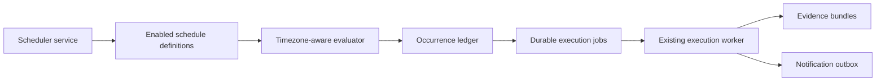

# Scheduler Trigger

## Purpose

The Scheduler Trigger is a producer-only service. It evaluates enabled schedule monitoring definitions and creates durable execution jobs. The existing worker remains the sole campaign executor.

The scheduler never invokes Playwright, npm, campaign scripts, or the execution worker.

## Schedule Model

Schedule definitions use structured metadata:

- `frequency`: `hourly`, `daily`, or `weekly`
- `timezone`: an IANA timezone such as `Europe/Dublin`
- `minute`: 0 through 59
- `hour`: 0 through 23 for daily and weekly schedules
- `dayOfWeek`: 0 (Sunday) through 6 (Saturday) for weekly schedules

Evaluation uses local wall-clock values in the configured timezone and stores the resolved occurrence as UTC. The occurrence key includes the monitoring definition, local scheduled minute, and timezone.

## Runtime

The dashboard supervisor starts three independent processes:

1. Next.js dashboard
2. Durable execution worker
3. Scheduler trigger

The scheduler wakes every 60 seconds by default. `INSSA_SCHEDULER_INTERVAL_MS` may change the interval but cannot reduce it below one second. `npm run dashboard:scheduler -- --once` performs one evaluation for operational validation.

## Idempotency And Recovery

Each scheduled occurrence is recorded before job creation. Its occurrence key is unique in both local and Supabase stores. Repeated evaluations and scheduler restarts therefore cannot enqueue a second job for the same occurrence.

An occurrence claim has a two-minute lease. A restart may reclaim a stale unqueued claim, while an active claim cannot be stolen by another scheduler. The execution job also receives `monitor:<occurrence-key>` as its durable idempotency key, providing a second deduplication boundary.

If the one-active-run rule prevents enqueueing, the occurrence remains claimed and is retried after its claim expires. No campaign is run directly by the scheduler.

## Persistence

- Local fallback: `dashboard/.data/scheduler-state.json`
- Supabase occurrence ledger: `monitoring_schedule_occurrences`
- Supabase runtime status: `scheduler_runtime_status`
- Migration: `dashboard/supabase/migrations/20260724_scheduler_trigger.sql`

The occurrence ledger references monitoring definitions with cascade behavior and campaign runs with set-null behavior. The table and scheduler status are RLS-protected and service-role-only.

The local store uses the platform inter-process lock and atomic rename. Supabase uses a unique occurrence key and conditional stale-claim updates.

## Status API

`GET /api/scheduler/status` requires the existing viewer-or-higher API guard and returns read-only runtime metadata:

- Running state, derived from the persisted heartbeat
- Last heartbeat
- Last evaluation
- Definitions evaluated
- Total jobs queued
- Jobs queued today
- Per-definition last and next occurrence metadata
- Last scheduler error

The Monitoring workspace intentionally displays only Running, Heartbeat, Last Evaluation, and Jobs Queued Today. It has no scheduler controls.

## Safety Boundaries

- Only enabled `schedule` definitions are evaluated.
- The enabled scheduled catalog targets the INSSA Safe Suite. All authentication monitoring schedules are seeded disabled for the first hosted deployment.
- The command registry and environment guard validate every enqueued command.
- The scheduler cannot execute commands or bypass the worker.
- Notification delivery remains absent; normal worker events continue to enter the durable outbox.
- Production protections, authentication, RBAC, evidence, reports, and SIEM behavior are unchanged.

## Operational Validation

1. Run `npm --prefix dashboard run test:execution-foundation`.
2. Run `npm run dashboard:scheduler -- --once` to evaluate without starting a recurring process.
3. Start the platform with `npm run dashboard:dev` or `npm run dashboard:start`.
4. Confirm the Monitoring workspace reports a current heartbeat.
5. Confirm one due occurrence creates one durable job.
6. Re-run the one-shot scheduler and confirm no duplicate job is created.
7. Confirm the existing worker completes the run, indexes evidence, and emits normal Notification Outbox events.
